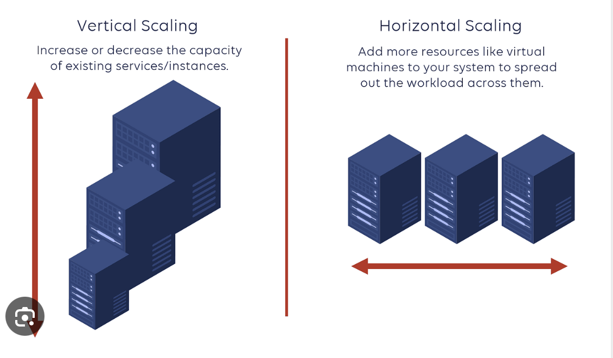
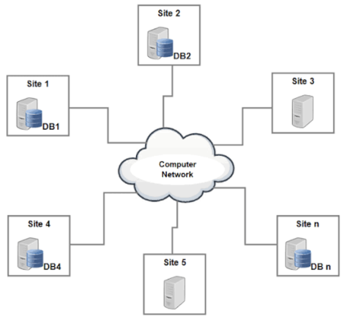
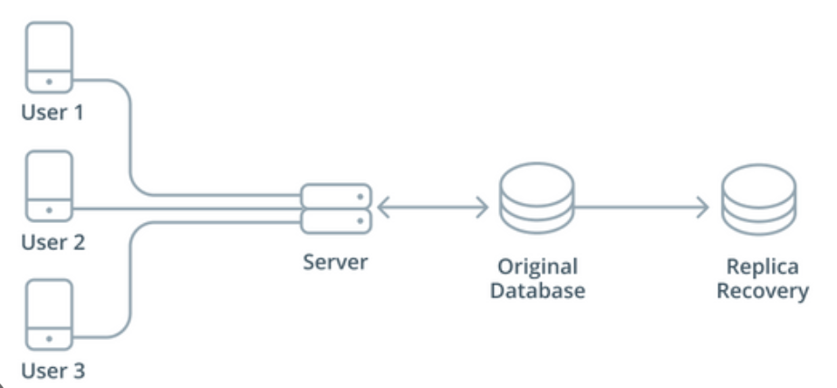
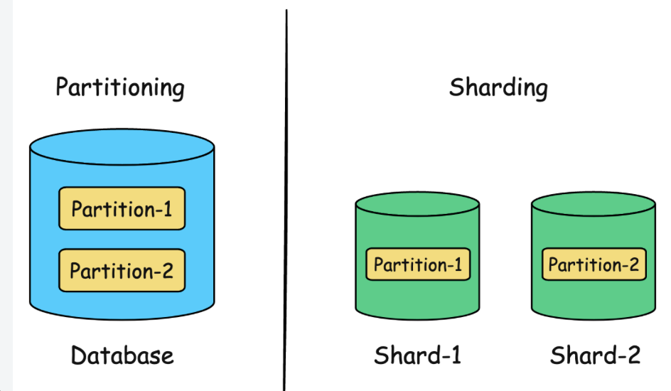
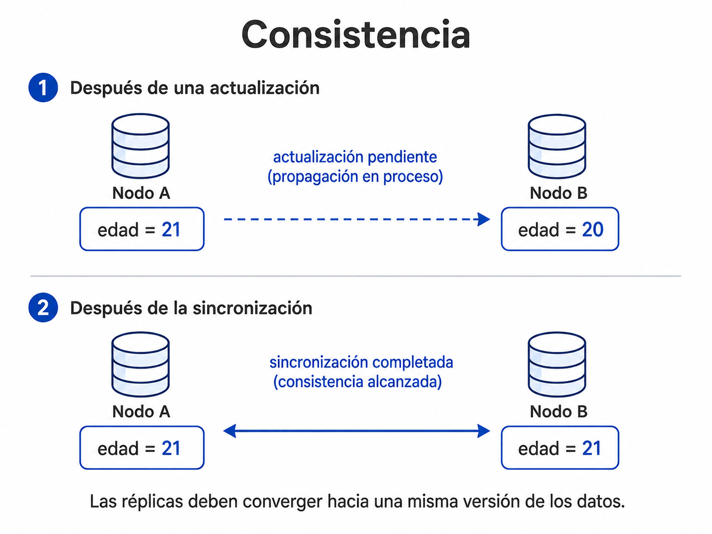
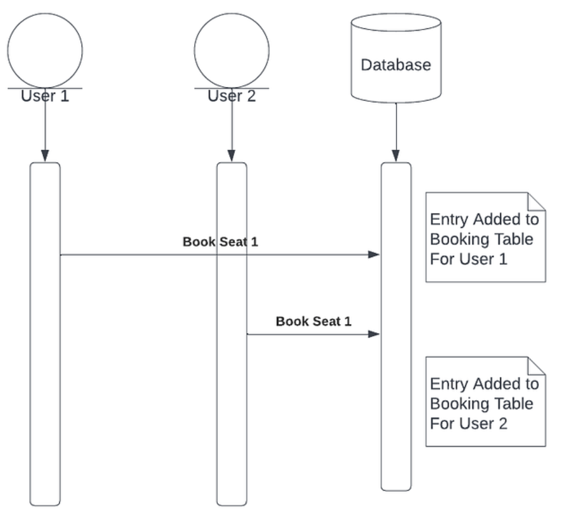
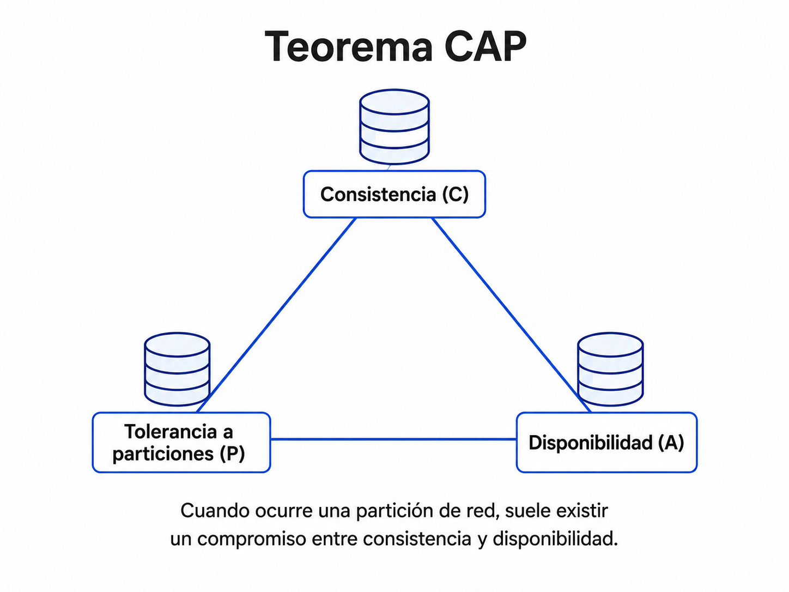
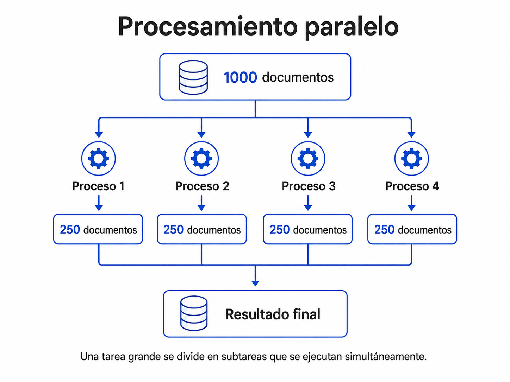

## Introducción

En el tema anterior revisamos distintas formas de representar la información y analizamos por qué existen diferentes modelos de bases de datos.

Ahora cambiaremos ligeramente la pregunta.

Ya no nos concentraremos únicamente en:

> ¿Cómo representamos los datos?

También necesitamos preguntarnos:

> ¿Qué ocurre cuando una aplicación crece y debe atender cada vez más usuarios, consultas y datos?

A medida que un sistema aumenta su tamaño pueden aparecer nuevos retos:

- más usuarios conectados al mismo tiempo;
- mayor volumen de información;
- más consultas por segundo;
- más operaciones simultáneas;
- mayor necesidad de almacenamiento;
- mayores requerimientos de procesamiento.

Estos problemas están relacionados con conceptos como **escalabilidad, sistemas distribuidos, replicación, particionamiento, consistencia y concurrencia** [@kleppmann2017].

::: {.callout-note}
## Idea clave

Una aplicación puede funcionar perfectamente con pocos usuarios y comenzar a presentar problemas cuando aumenta la demanda.

El diseño que funciona para:

```text
100 usuarios
```

no necesariamente será suficiente para:

```text
10,000,000 de usuarios
```
:::

## Punto de partida

Imaginemos una plataforma que almacena:

```text
perfiles de usuarios
publicaciones
imágenes
comentarios
registros de actividad
```

Al principio, un solo servidor puede ser suficiente.

Por ejemplo:

```text
Usuarios
   │
   ↓
Servidor
   │
   ↓
Base de datos
```

Sin embargo, conforme aumenta el número de usuarios también aumenta la cantidad de información y de solicitudes que debe procesar el sistema.

Podríamos pasar de:

```text
100 usuarios
500 publicaciones
20 usuarios conectados
```

a:

```text
100,000 usuarios
5,000,000 publicaciones
10,000 usuarios conectados
```

y posteriormente a:

```text
10,000,000 usuarios
500,000,000 publicaciones
100,000 usuarios conectados
```

Ahora el sistema debe procesar muchas más operaciones:

```text
iniciar sesión
consultar perfiles
publicar contenido
registrar comentarios
buscar usuarios
actualizar información
mostrar recomendaciones
```

La pregunta entonces es:

> ¿Cómo aumentamos la capacidad del sistema para que continúe funcionando adecuadamente?

Esto nos lleva al concepto de **escalabilidad**.

## ¿Qué es la escalabilidad?

La **escalabilidad** es la capacidad de un sistema para mantener un funcionamiento adecuado cuando aumenta la demanda [@kleppmann2017].

La carga puede crecer debido a:

- mayor cantidad de usuarios;
- crecimiento del volumen de datos;
- aumento del número de consultas;
- mayor cantidad de operaciones simultáneas;
- necesidad de procesar información con mayor rapidez.

Existen dos estrategias generales para aumentar la capacidad de un sistema:

```text
Escalabilidad vertical
Escalabilidad horizontal
```

## Escalabilidad vertical y horizontal

### Escalabilidad vertical

La **escalabilidad vertical**, también conocida como *scale up*, consiste en aumentar los recursos de una misma máquina.

Por ejemplo:

```text
Servidor inicial
├── 4 núcleos
├── 8 GB RAM
└── 500 GB de almacenamiento
```

podría sustituirse o ampliarse a:

```text
Servidor más potente
├── 32 núcleos
├── 128 GB RAM
└── 8 TB de almacenamiento
```

La idea principal es:

```text
misma máquina
      +
más recursos
```

Se puede aumentar:

```text
RAM
CPU
almacenamiento
capacidad de procesamiento
```

### Ejemplo

Supongamos que el servidor de una universidad comienza a responder lentamente durante el periodo de inscripciones.

Una primera solución podría ser pasar de:

```text
8 GB RAM
```

a:

```text
32 GB RAM
```

o utilizar un procesador más potente.

En este caso estamos aumentando la capacidad del mismo servidor.

### Escalabilidad horizontal

La **escalabilidad horizontal**, también conocida como *scale out*, consiste en agregar más servidores o nodos al sistema.

En lugar de utilizar únicamente:

```text
Servidor 1
```

podemos trabajar con:

```text
Servidor 1
Servidor 2
Servidor 3
Servidor 4
```

y repartir el trabajo entre ellos.

Por ejemplo:

```text
Usuarios
   │
   ↓
Distribución de carga
   │
   ├──── Servidor 1
   ├──── Servidor 2
   └──── Servidor 3
```

Esta estrategia está estrechamente relacionada con los sistemas distribuidos [@kleppmann2017].

{width=85% fig-align="center"}

La diferencia puede resumirse de forma sencilla:

```text
Vertical   → hacer más poderosa una máquina

Horizontal → agregar más máquinas
```

## Comparación de escalabilidad

| Problema | Escalabilidad vertical | Escalabilidad horizontal |
|---|---|---|
| Poca memoria | Agregar RAM | Agregar nodos |
| Muchas consultas | Mejorar CPU | Distribuir consultas |
| Muchos datos | Aumentar disco | Distribuir información |
| Alta demanda | Mejorar servidor | Repartir carga |

La escalabilidad vertical puede ser más sencilla inicialmente, pero existe un límite físico y económico sobre cuánto puede crecer una sola máquina.

La escalabilidad horizontal permite incorporar nuevos nodos conforme aumenta la demanda, aunque también introduce nuevos retos de coordinación.

::: {.callout-tip}
## Una analogía

Imaginemos un restaurante.

**Escalabilidad vertical**

```text
un cocinero
     ↓
un cocinero con mejores herramientas
```

**Escalabilidad horizontal**

```text
un cocinero
     ↓
varios cocineros trabajando juntos
```

Agregar personas aumenta la capacidad, pero también requiere coordinación.
:::

## Bases de datos distribuidas

La escalabilidad horizontal nos conduce al concepto de **sistema distribuido**.

Una base de datos distribuida almacena y gestiona información utilizando varios servidores o **nodos** conectados mediante una red.

Los datos pueden encontrarse:

- distribuidos entre diferentes servidores;
- replicados en varios nodos;
- almacenados en diferentes ubicaciones físicas;
- administrados como parte de un mismo sistema.

[@kleppmann2017]

{width=85% fig-align="center"}

Desde la perspectiva del usuario, estos servidores pueden comportarse como un solo sistema.

```text
Usuario
   │
   ↓
Sistema distribuido
   │
   ├── Nodo A
   ├── Nodo B
   └── Nodo C
```

## ¿Qué es un nodo?

En un sistema distribuido, cada servidor participante puede considerarse un **nodo**.

Un nodo puede:

- almacenar una parte de la información;
- mantener una copia de determinados datos;
- recibir consultas;
- realizar operaciones;
- comunicarse con otros nodos.

Por ejemplo:

```text
Nodo A ───── Nodo B
   │            │
   └──── Nodo C ┘
```

Los nodos trabajan coordinadamente para formar un único sistema lógico.

::: {.callout-note}
## Importante

Que una base sea distribuida no significa simplemente que tengamos varias computadoras.

Los nodos necesitan mecanismos para:

```text
comunicarse
coordinarse
intercambiar información
manejar fallos
mantener los datos
```
:::

## Replicación

Una estrategia utilizada en sistemas distribuidos es la **replicación**.

La replicación consiste en mantener copias de la misma información en diferentes nodos [@kleppmann2017].

Por ejemplo:

```text
Dato original
     │
     ├── Nodo A
     ├── Nodo B
     └── Nodo C
```

Los tres nodos pueden almacenar una copia del mismo dato.

{width=80% fig-align="center"}

### ¿Por qué replicar?

La replicación puede ayudar a:

- aumentar la disponibilidad;
- mantener copias de respaldo;
- mejorar la tolerancia a fallos;
- distribuir algunas operaciones de lectura.

### Ejemplo

Supongamos que tenemos:

```text
Nodo A → información de usuarios
Nodo B → copia de información de usuarios
Nodo C → copia de información de usuarios
```

Si el Nodo A presenta una falla, todavía existen otras copias.

```text
Nodo A ❌

Nodo B ✓
Nodo C ✓
```

El sistema podría continuar funcionando utilizando alguno de los nodos disponibles.

### Ventajas y retos

| Ventajas | Retos |
|---|---|
| Mayor disponibilidad | Sincronización |
| Tolerancia a fallos | Mayor uso de almacenamiento |
| Copias de los datos | Retrasos entre réplicas |
| Distribución de lecturas | Posibles inconsistencias temporales |

::: {.callout-note}
## Replicar significa copiar

La idea fundamental es:

```text
mismos datos
   ↓
varios nodos
```

No debemos confundirla con particionamiento.
:::

## Particionamiento de datos

Otra estrategia consiste en **dividir la información**.

El particionamiento permite separar un conjunto grande de datos en partes más pequeñas.

Por ejemplo:

| Nodo | Información almacenada |
|---|---|
| Nodo 1 | Usuarios 1–1000 |
| Nodo 2 | Usuarios 1001–2000 |
| Nodo 3 | Usuarios 2001–3000 |

Cada nodo almacena solamente una parte del conjunto total.

{width=80% fig-align="center"}

Podemos visualizarlo así:

```text
Todos los usuarios
       │
       ├── Usuarios 1–1000
       │       ↓
       │     Nodo 1
       │
       ├── Usuarios 1001–2000
       │       ↓
       │     Nodo 2
       │
       └── Usuarios 2001–3000
               ↓
             Nodo 3
```

## Particionamiento y *sharding*

Cuando las diferentes particiones de los datos se distribuyen entre distintos nodos, se utiliza comúnmente el término **sharding** [@kleppmann2017].

Por ejemplo:

```text
Base completa
     │
     ├── Fragmento A → Nodo A
     ├── Fragmento B → Nodo B
     └── Fragmento C → Nodo C
```

Cada fragmento suele denominarse *shard*.

El objetivo es evitar que un solo servidor tenga que almacenar y procesar todo el conjunto de datos.

## Replicación vs. particionamiento

Aunque ambos conceptos aparecen frecuentemente juntos, resuelven problemas diferentes.

| Replicación | Particionamiento |
|---|---|
| Se crean copias | Se dividen los datos |
| Los mismos datos pueden aparecer en varios nodos | Cada nodo puede almacenar una parte |
| Ayuda a disponibilidad | Ayuda a distribuir grandes volúmenes |
| Puede facilitar recuperación ante fallos | Permite repartir almacenamiento y carga |

Una forma sencilla de recordarlos es:

```text
Replicación
A → A → A

Particionamiento
ABC → A | B | C
```

::: {.callout-tip}
## También pueden combinarse

Un sistema real puede tener:

```text
Partición A
├── copia 1
└── copia 2

Partición B
├── copia 1
└── copia 2
```

Es decir, los datos pueden estar **particionados y replicados al mismo tiempo**.
:::

## Consistencia

La replicación introduce una nueva pregunta:

> ¿Qué ocurre cuando modificamos un dato que tiene varias copias?

Supongamos que dos nodos contienen:

```text
Nodo A: edad = 20
Nodo B: edad = 20
```

El usuario actualiza su edad:

```text
20 → 21
```

La modificación llega primero al Nodo A:

```text
Nodo A: edad = 21
Nodo B: edad = 20
```

Durante un breve periodo, los dos nodos contienen valores distintos.

{width=80% fig-align="center"}

Después de la sincronización:

```text
Nodo A: edad = 21
Nodo B: edad = 21
```

La **consistencia** está relacionada con qué tan coherente es la información observada por los distintos participantes del sistema [@kleppmann2017].

::: {.callout-note}
## Pregunta importante

Si un usuario consulta:

```text
Nodo A → edad = 21
```

y otro consulta:

```text
Nodo B → edad = 20
```

¿qué comportamiento debería tener el sistema?

La respuesta depende del modelo de consistencia utilizado y de las necesidades de la aplicación.
:::

## ¿Toda inconsistencia temporal es igual de grave?

No necesariamente.

Imaginemos dos escenarios.

### Una red social

Un usuario publica una fotografía.

Puede ser aceptable que:

```text
Nodo A → publicación visible

Nodo B → todavía no visible
```

durante unos segundos.

### Una operación financiera

En cambio, si hablamos del saldo de una cuenta:

```text
Nodo A → $10,000

Nodo B → $8,000
```

una diferencia temporal puede tener consecuencias mucho más importantes.

Por eso los requisitos de consistencia dependen del problema.

## Concurrencia

La **concurrencia** ocurre cuando múltiples usuarios o procesos intentan acceder o modificar información al mismo tiempo.

Por ejemplo:

```text
Producto disponible: 1
```

Dos usuarios intentan comprarlo simultáneamente:

```text
Usuario A ── Comprar ──┐
                       ├── mismo producto
Usuario B ── Comprar ──┘
```

{width=80% fig-align="center"}

Otro ejemplo puede ser la reservación de un asiento.

```text
Asiento 15A
    │
    ├── Usuario A → reservar
    │
    └── Usuario B → reservar
```

Si el sistema no coordina correctamente las operaciones podría ocurrir una doble reserva.

## Problemas de concurrencia

Cuando la concurrencia no se controla adecuadamente pueden aparecer:

- actualizaciones perdidas;
- datos inconsistentes;
- operaciones duplicadas;
- lecturas de información desactualizada;
- conflictos entre operaciones simultáneas.

### Ejemplo de actualización perdida

Supongamos:

```text
Saldo inicial = 100
```

Dos procesos leen ese mismo valor:

```text
Proceso A lee 100
Proceso B lee 100
```

Después:

```text
Proceso A suma 20  → 120
Proceso B resta 10 → 90
```

Si ambos escriben sin coordinación, una de las modificaciones podría sobrescribir a la otra.

::: {.callout-tip}
## Consistencia y concurrencia no son lo mismo

**Consistencia**

se relaciona con mantener una visión coherente de la información.

**Concurrencia**

se relaciona con múltiples operaciones que ocurren al mismo tiempo.

Son conceptos diferentes, aunque pueden estar estrechamente relacionados.
:::

## Teorema CAP

Uno de los conceptos más conocidos en sistemas distribuidos es el **teorema CAP**.

CAP describe tres propiedades:

```text
C → Consistency
A → Availability
P → Partition Tolerance
```

[@kleppmann2017]

{width=80% fig-align="center"}

### C — Consistency

Los nodos ofrecen una visión coherente de la información.

De manera simplificada, después de una actualización esperamos que las consultas observen el valor correcto de acuerdo con las garantías del sistema.

### A — Availability

Cada solicitud realizada a un nodo operativo recibe una respuesta.

El sistema intenta continuar atendiendo las solicitudes.

### P — Partition Tolerance

El sistema puede continuar operando a pesar de que exista una interrupción de comunicación entre algunos nodos.

## ¿Qué es una partición de red?

Supongamos que tenemos:

```text
Nodo A ←────────→ Nodo B
```

Normalmente los nodos intercambian información.

Ahora ocurre una falla:

```text
Nodo A      X      Nodo B
```

Ambos nodos pueden continuar encendidos, pero ya no pueden comunicarse correctamente.

Eso es una **partición de red**.

## El compromiso del teorema CAP

Cuando existe una partición de red, el sistema debe decidir cómo responder.

### Priorizar consistencia

Puede evitar responder si no puede garantizar que los datos sean coherentes.

```text
No estoy seguro de tener
el valor actualizado
        ↓
no respondo todavía
```

### Priorizar disponibilidad

Puede continuar respondiendo aunque temporalmente algunos nodos tengan información diferente.

```text
Nodo A → valor nuevo
Nodo B → valor anterior
```

El servicio continúa disponible, aunque puede existir una diferencia temporal.

::: {.callout-warning}
## CAP no significa simplemente “elegir dos de tres”

Una simplificación frecuente consiste en decir:

```text
CAP = elegir dos de tres
```

Esto puede ser engañoso.

El compromiso importante aparece **cuando existe una partición de red**. En ese escenario, un sistema distribuido debe decidir cómo equilibrar consistencia y disponibilidad [@kleppmann2017].
:::

## Ejemplo conceptual de CAP

### Sistema bancario

En una operación financiera puede resultar muy importante evitar mostrar información incorrecta.

Por ejemplo:

```text
Saldo correcto: $5,000
```

puede ser preferible no completar temporalmente una operación antes que utilizar un saldo incorrecto.

En determinados escenarios podría priorizarse la **consistencia**.

### Red social

En una red social puede ser aceptable que una publicación tarde algunos segundos en aparecer en todos los nodos.

Por ejemplo:

```text
Nodo A → publicación visible
Nodo B → todavía sincronizando
```

La aplicación puede continuar funcionando.

En determinados escenarios puede priorizarse la **disponibilidad**.

::: {.callout-note}
Estos son ejemplos conceptuales para comprender el compromiso.

En sistemas reales, las decisiones son más específicas y dependen del diseño, de cada operación y de las garantías ofrecidas por la tecnología utilizada.
:::

## Procesamiento paralelo

El **procesamiento paralelo** consiste en dividir una tarea en varias partes que pueden ejecutarse simultáneamente.

Puede utilizarse para:

- procesar grandes volúmenes de información;
- reducir tiempos de ejecución;
- distribuir tareas entre varios procesadores;
- aprovechar varios nodos;
- ejecutar diferentes operaciones al mismo tiempo.

{width=80% fig-align="center"}

## Ejemplo de procesamiento paralelo

Supongamos que necesitamos procesar:

```text
1000 documentos
```

En lugar de procesarlos uno por uno con un solo proceso:

```text
Proceso 1
   ↓
1000 documentos
```

podemos dividir el trabajo:

```text
1000 documentos
      │
      ├── Proceso 1 → 250
      ├── Proceso 2 → 250
      ├── Proceso 3 → 250
      └── Proceso 4 → 250
```

Los cuatro procesos pueden ejecutarse simultáneamente.

Después:

```text
Resultado 1
Resultado 2
Resultado 3
Resultado 4
     │
     ↓
Resultado final
```

Si el problema puede dividirse adecuadamente, esta estrategia puede reducir el tiempo total de procesamiento.

::: {.callout-tip}
## Ejemplo en Ciencia de Datos

Supongamos que necesitamos analizar:

```text
1,000,000 de comentarios
```

Podríamos dividirlos en grupos y procesarlos de manera paralela.

```text
Comentarios
    │
    ├── lote 1 → proceso 1
    ├── lote 2 → proceso 2
    ├── lote 3 → proceso 3
    └── lote 4 → proceso 4
```

Posteriormente se combinan los resultados.
:::

## Procesamiento paralelo y sistemas distribuidos

Los conceptos están relacionados, pero no son exactamente lo mismo.

El procesamiento paralelo busca ejecutar varias tareas simultáneamente.

Un sistema distribuido utiliza varias máquinas o nodos que se comunican mediante una red.

Podemos tener procesamiento paralelo:

```text
en una sola máquina
```

utilizando varios núcleos, o:

```text
entre varias máquinas
```

dentro de un sistema distribuido.

## Relación entre los conceptos

Los conceptos estudiados durante este tema están conectados.

```text
Crecimiento de datos y usuarios
              ↓
        Escalabilidad
              ↓
   Bases de datos distribuidas
              ↓
  Replicación y particionamiento
              ↓
Consistencia, concurrencia y CAP
              ↓
    Procesamiento y operación
       sobre varios recursos
```

El crecimiento de un sistema puede hacer necesario escalar.

La escalabilidad horizontal puede llevar a utilizar varios nodos.

Al utilizar varios nodos necesitamos decidir cómo almacenar los datos.

Podemos:

```text
replicarlos
particionarlos
o combinar ambas estrategias
```

A partir de ahí aparecen nuevos retos de:

```text
consistencia
concurrencia
disponibilidad
comunicación entre nodos
tolerancia a fallos
```

[@kleppmann2017]

## Ejemplo integrado

Imaginemos una plataforma de comercio electrónico.

Inicialmente:

```text
Usuarios
   ↓
Servidor
   ↓
Base de datos
```

Conforme aumenta la demanda podemos agregar servidores:

```text
Usuarios
   ↓
varios servidores
```

La base puede dividirse:

```text
Productos A–M → Nodo 1
Productos N–Z → Nodo 2
```

y además replicarse:

```text
Nodo 1 → Réplica 1
Nodo 2 → Réplica 2
```

Ahora debemos considerar:

```text
¿qué ocurre si un nodo falla?

¿cómo se actualizan las copias?

¿qué sucede si dos usuarios compran el último producto?

¿qué ocurre si dos nodos dejan de comunicarse?
```

Es decir, el crecimiento de una aplicación transforma un problema aparentemente sencillo de almacenamiento en un problema de **arquitectura distribuida**.

## Actividad de autoevaluación

Relaciona cada situación con el concepto correspondiente.

| Situación | Concepto |
|---|---|
| Agregar más RAM al servidor | ___ |
| Agregar tres servidores nuevos | ___ |
| Guardar la misma información en dos nodos | ___ |
| Dividir usuarios entre diferentes servidores | ___ |
| Dos personas intentan reservar el mismo asiento | ___ |
| Dos réplicas muestran temporalmente valores distintos | ___ |
| Los nodos pierden comunicación entre sí | ___ |
| Dividir 1000 documentos entre cuatro procesos | ___ |

::: {.callout-tip}
## Posibles respuestas

```text
Agregar RAM
→ escalabilidad vertical

Agregar servidores
→ escalabilidad horizontal

Copiar información
→ replicación

Dividir usuarios
→ particionamiento

Reservar el mismo asiento
→ concurrencia

Valores distintos entre réplicas
→ consistencia

Pérdida de comunicación
→ partición de red

Dividir documentos
→ procesamiento paralelo
```
:::

## Ideas clave del tema

::: {.callout-note}
## 1. Escalar no significa solamente comprar una computadora más potente

Podemos escalar:

```text
verticalmente
```

aumentando recursos de una máquina, o:

```text
horizontalmente
```

agregando más nodos.
:::

::: {.callout-note}
## 2. Una base distribuida utiliza varios nodos

Los nodos pueden participar en:

```text
almacenamiento
consultas
procesamiento
replicación
particionamiento
```
:::

::: {.callout-note}
## 3. Replicación y particionamiento son diferentes

```text
Replicar      → copiar datos

Particionar   → dividir datos
```

Ambas estrategias pueden combinarse.
:::

::: {.callout-note}
## 4. Distribuir los datos introduce nuevos retos

Cuando varios nodos participan en el sistema aparecen preguntas relacionadas con:

```text
consistencia
sincronización
concurrencia
disponibilidad
fallos de comunicación
```
:::

::: {.callout-note}
## 5. CAP debe entenderse en presencia de una partición

Ante una interrupción de comunicación entre nodos, el sistema debe decidir cómo equilibrar:

```text
consistencia
disponibilidad
```

manteniendo la tolerancia a la partición necesaria para continuar operando como sistema distribuido [@kleppmann2017].
:::

::: {.callout-note}
## 6. El procesamiento paralelo divide el trabajo

Una tarea puede dividirse en partes que se ejecutan simultáneamente para aprovechar mejor los recursos disponibles.
:::

## En la siguiente sesión

Después de comprender los fundamentos de escalabilidad y sistemas distribuidos, podremos relacionar estos conceptos con gestores NoSQL concretos.

MongoDB nos permitirá comenzar a trabajar con:

```text
bases de datos
colecciones
documentos
campos
arreglos
objetos anidados
consultas
```

y observar de manera práctica cómo funciona una base de datos orientada a documentos.

## Referencias