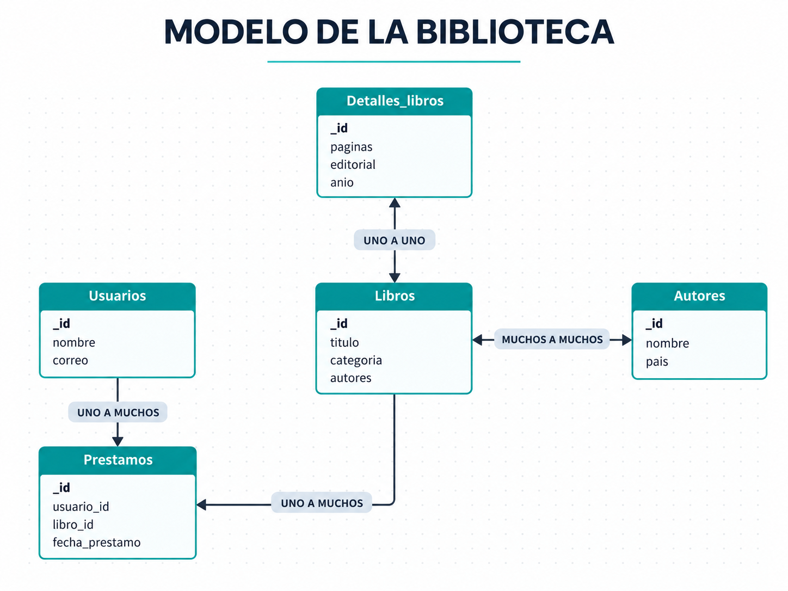
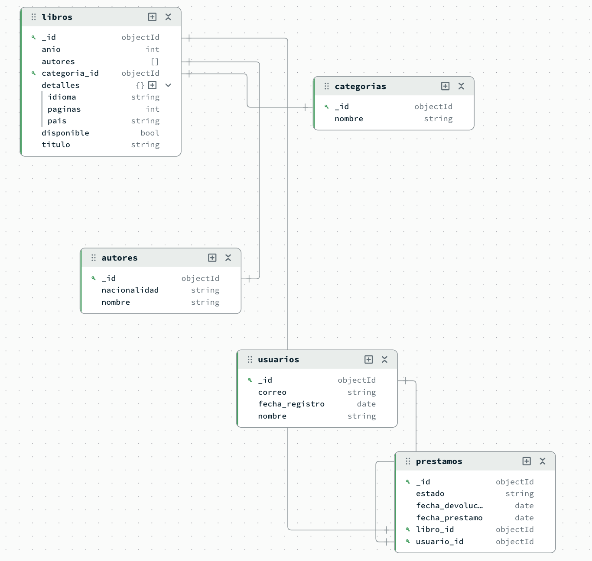

## Modelado de relaciones en MongoDB

Hasta ahora hemos trabajado con documentos, colecciones, consultas y exportación de datos en MongoDB.

En esta parte nos concentraremos en una pregunta diferente:

```text
¿Cómo podemos relacionar los documentos entre sí?
```

Para ello construiremos una base de datos llamada:

```text
biblioteca
```

utilizando MongoDB Compass.

Trabajaremos con las colecciones:

```text
biblioteca
│
├── autores
├── categorias
├── libros
├── usuarios
└── prestamos
```

Los libros y autores corresponden a obras conocidas. Los usuarios y préstamos son datos ficticios utilizados únicamente con fines académicos.

---

## Tipos de relaciones

Antes de construir la base `biblioteca`, necesitamos identificar cómo se relacionan los datos.

En este ejemplo utilizaremos tres tipos principales:

```text
uno a uno
uno a muchos
muchos a muchos
```

La diferencia entre ellos depende de cuántos elementos de una entidad pueden relacionarse con elementos de otra.

### Relación uno a uno

Una relación **uno a uno** ocurre cuando un elemento se relaciona con un solo elemento y ese segundo elemento pertenece únicamente al primero.

Se representa como:

```text
1 : 1
```

En nuestro ejemplo podemos pensar en:

```text
LIBRO 1 ───── 1 DETALLES
```

Un libro tiene un conjunto de detalles propios, por ejemplo:

```text
idioma
número de páginas
país
```

Por ejemplo:

```text
Pedro Páramo
   ↓
detalles
   ├── idioma: Español
   ├── páginas: 136
   └── país: México
```

Estos datos pertenecen específicamente a ese libro.

Por eso podemos pensar conceptualmente en una relación:

```text
Libro 1 : 1 Detalles
```

En MongoDB no necesariamente necesitamos crear una colección independiente para representar esta relación.

Podemos incrustar los datos directamente dentro del documento:

```javascript
{
  titulo: "Pedro Páramo",
  detalles: {
    idioma: "Español",
    paginas: 136,
    pais: "México"
  }
}
```

Por lo tanto:

```text
un libro
↓
un conjunto de detalles
```

y esos detalles se encuentran dentro del mismo documento.

::: {.callout-note}
## ¿Por qué es uno a uno?

Porque los detalles almacenados pertenecen a un solo libro y no se reutilizan en otros documentos.
:::

### Relación uno a muchos

Una relación **uno a muchos** ocurre cuando un elemento puede relacionarse con varios elementos.

Se representa como:

```text
1 : N
```

En nuestra biblioteca tendremos varios ejemplos.

#### Categorías y libros

Una categoría puede estar asociada con muchos libros.

Por ejemplo:

```text
Novela
   ↓
Pedro Páramo
Aura
Rayuela
Como agua para chocolate
Crónica de una muerte anunciada
```

Por lo tanto:

```text
CATEGORIA 1 ───── N LIBROS
```

Cada libro tendrá una sola categoría principal en nuestro modelo:

```javascript
categoria_id: ObjectId("...")
```

pero una misma categoría puede estar relacionada con muchos documentos de `libros`.

::: {.callout-note}
## ¿Por qué es uno a muchos?

Porque una categoría puede relacionarse con varios libros, mientras que cada libro tendrá una categoría principal.
:::

#### Usuarios y préstamos

También tendremos:

```text
USUARIO 1 ───── N PRESTAMOS
```

Un usuario puede pedir varios libros a lo largo del tiempo.

Por ejemplo:

```text
Ana López
   ↓
Pedro Páramo
1984
El llano en llamas
```

Los datos de Ana se almacenan una sola vez en:

```text
usuarios
```

y cada préstamo guarda una referencia:

```javascript
usuario_id: ObjectId("...")
```

Por lo tanto:

```text
un usuario
↓
muchos préstamos
```

#### Libros y préstamos

Un libro también puede aparecer en varios préstamos a lo largo del tiempo.

Por ejemplo:

```text
Pedro Páramo
   ↓
préstamo 1
préstamo 2
préstamo 3
```

Por lo tanto:

```text
LIBRO 1 ───── N PRESTAMOS
```

Un mismo libro permanece como un solo documento en `libros`, mientras distintos documentos de `prestamos` pueden referenciarlo.

::: {.callout-tip}
## Una misma colección puede participar en varias relaciones

La colección `prestamos` permite relacionar:

```text
un usuario
+
un libro
```

Por eso tendremos simultáneamente:

```text
USUARIO 1 ───── N PRESTAMOS

LIBRO   1 ───── N PRESTAMOS
```
:::

### Relación muchos a muchos

Una relación **muchos a muchos** ocurre cuando varios elementos de una entidad pueden relacionarse con varios elementos de otra.

Se representa como:

```text
N : N
```

En nuestro ejemplo utilizaremos:

```text
AUTORES N ───── N LIBROS
```

Esto ocurre por dos razones.

Primero, un autor puede escribir varios libros.

Por ejemplo:

```text
Juan Rulfo
   ↓
Pedro Páramo
El llano en llamas
```

Por otro lado, un libro puede tener más de un autor.

Por ejemplo:

```text
Buenos presagios
   ↓
Neil Gaiman
Terry Pratchett
```

También:

```text
El talismán
   ↓
Stephen King
Peter Straub
```

Por lo tanto, no podemos decir solamente:

```text
un autor → un libro
```

ni:

```text
un autor → muchos libros
```

porque también existen libros relacionados con varios autores.

La relación completa es:

```text
muchos autores
↕
muchos libros
```

En nuestros documentos almacenaremos las referencias de los autores dentro de un arreglo:

```javascript
autores: [
  ObjectId("..."),
  ObjectId("...")
]
```

Por ejemplo:

```javascript
{
  titulo: "Buenos presagios",
  autores: [
    ObjectId("65000000000000000000000a"),
    ObjectId("65000000000000000000000b")
  ]
}
```

::: {.callout-note}
## ¿Por qué es muchos a muchos?

Porque un autor puede relacionarse con varios libros y, al mismo tiempo, un libro puede relacionarse con varios autores.
:::

---

## Modelo general de la biblioteca

Ahora podemos representar visualmente las relaciones principales del ejemplo.

{fig-align="center" width="90%"}

En el modelo podemos identificar:

```text
Libro ↔ Detalles
1 : 1
```

```text
Usuario → Préstamos
1 : N
```

```text
Libro → Préstamos
1 : N
```

```text
Autores ↔ Libros
N : N
```

::: {.callout-note}
## Importante

La figura muestra el modelo conceptual de relaciones.

Más adelante veremos cómo estas relaciones se representan en MongoDB mediante documentos incrustados y referencias con `ObjectId`.
:::

## Resumen de relaciones de la biblioteca

| Relación | Tipo | Razón |
|---|---|---|
| Libro → Detalles | 1 : 1 | Cada libro tiene sus propios detalles |
| Categoría → Libros | 1 : N | Una categoría puede contener varios libros |
| Usuario → Préstamos | 1 : N | Un usuario puede realizar varios préstamos |
| Libro → Préstamos | 1 : N | Un libro puede prestarse varias veces |
| Autores ↔ Libros | N : N | Un autor puede escribir varios libros y un libro puede tener varios autores |

---

## Incrustar o referenciar

MongoDB permite representar información relacionada principalmente de dos maneras:

```text
incrustar
```

o:

```text
referenciar
```

### Documento incrustado

Los datos relacionados se almacenan dentro del mismo documento.

Por ejemplo:

```javascript
{
  titulo: "Pedro Páramo",
  detalles: {
    idioma: "Español",
    paginas: 136,
    pais: "México"
  }
}
```

La información de `detalles` pertenece directamente al libro.

### Documento referenciado

Los datos se encuentran en colecciones diferentes y se relacionan mediante `ObjectId`.

Por ejemplo:

```javascript
{
  titulo: "Pedro Páramo",
  autores: [
    ObjectId("650000000000000000000001")
  ]
}
```

El identificador corresponde a un documento de la colección:

```text
autores
```

Una orientación sencilla es:

| Situación | Estrategia |
|---|---|
| Los datos normalmente se consultan juntos | Incrustar |
| Los datos pertenecen únicamente al documento principal | Incrustar |
| El dato se reutiliza en varios documentos | Referenciar |
| El dato puede crecer considerablemente | Referenciar |
| Existe una relación entre varias entidades | Referenciar |

::: {.callout-note}
MongoDB no obliga a utilizar una sola estrategia. Una misma base puede combinar documentos incrustados y referencias.
:::

---

## Crear la base `biblioteca`

En MongoDB Compass crea:

```text
Database Name:
biblioteca
```

Como primera colección utiliza:

```text
autores
```

A partir de este punto utilizaremos el `mongosh` integrado en Compass para cargar rápidamente los documentos mediante `insertMany()`.

Primero selecciona la base:

```javascript
use biblioteca
```

---

## Colección `autores`

Insertaremos los autores con identificadores definidos previamente para facilitar las relaciones.

```javascript
db.autores.insertMany([
  {
    _id: ObjectId("650000000000000000000001"),
    nombre: "Juan Rulfo",
    nacionalidad: "Mexicana"
  },
  {
    _id: ObjectId("650000000000000000000002"),
    nombre: "Carlos Fuentes",
    nacionalidad: "Mexicana"
  },
  {
    _id: ObjectId("650000000000000000000003"),
    nombre: "Laura Esquivel",
    nacionalidad: "Mexicana"
  },
  {
    _id: ObjectId("650000000000000000000004"),
    nombre: "Jorge Luis Borges",
    nacionalidad: "Argentina"
  },
  {
    _id: ObjectId("650000000000000000000005"),
    nombre: "Julio Cortázar",
    nacionalidad: "Argentina"
  },
  {
    _id: ObjectId("650000000000000000000006"),
    nombre: "George Orwell",
    nacionalidad: "Británica"
  },
  {
    _id: ObjectId("650000000000000000000007"),
    nombre: "Antoine de Saint-Exupéry",
    nacionalidad: "Francesa"
  },
  {
    _id: ObjectId("650000000000000000000008"),
    nombre: "Mary Shelley",
    nacionalidad: "Británica"
  },
  {
    _id: ObjectId("650000000000000000000009"),
    nombre: "Gabriel García Márquez",
    nacionalidad: "Colombiana"
  },
  {
    _id: ObjectId("65000000000000000000000a"),
    nombre: "Neil Gaiman",
    nacionalidad: "Británica"
  },
  {
    _id: ObjectId("65000000000000000000000b"),
    nombre: "Terry Pratchett",
    nacionalidad: "Británica"
  },
  {
    _id: ObjectId("65000000000000000000000c"),
    nombre: "Stephen King",
    nacionalidad: "Estadounidense"
  },
  {
    _id: ObjectId("65000000000000000000000d"),
    nombre: "Peter Straub",
    nacionalidad: "Estadounidense"
  }
])
```

---

## Colección `categorias`

Crea la colección:

```text
categorias
```

Después ejecuta:

```javascript
db.categorias.insertMany([
  {
    _id: ObjectId("660000000000000000000001"),
    nombre: "Novela"
  },
  {
    _id: ObjectId("660000000000000000000002"),
    nombre: "Cuento"
  },
  {
    _id: ObjectId("660000000000000000000003"),
    nombre: "Distopía"
  },
  {
    _id: ObjectId("660000000000000000000004"),
    nombre: "Fábula"
  },
  {
    _id: ObjectId("660000000000000000000005"),
    nombre: "Fantasía"
  },
  {
    _id: ObjectId("660000000000000000000006"),
    nombre: "Terror"
  }
])
```

Aquí tendremos una relación:

```text
CATEGORIA 1 ───── N LIBROS
```

---

## Colección `libros`

Crea:

```text
libros
```

En esta colección combinaremos:

```text
referencias
+
documentos incrustados
```

Los campos:

```text
autores
categoria_id
```

serán referencias.

El campo:

```text
detalles
```

será incrustado.

Ejecuta:

```javascript
db.libros.insertMany([
  {
    _id: ObjectId("670000000000000000000001"),
    titulo: "Pedro Páramo",
    anio: 1955,
    disponible: true,
    autores: [
      ObjectId("650000000000000000000001")
    ],
    categoria_id: ObjectId("660000000000000000000001"),
    detalles: {
      idioma: "Español",
      paginas: 136,
      pais: "México"
    }
  },
  {
    _id: ObjectId("670000000000000000000002"),
    titulo: "Aura",
    anio: 1962,
    disponible: true,
    autores: [
      ObjectId("650000000000000000000002")
    ],
    categoria_id: ObjectId("660000000000000000000001"),
    detalles: {
      idioma: "Español",
      paginas: 64,
      pais: "México"
    }
  },
  {
    _id: ObjectId("670000000000000000000003"),
    titulo: "Como agua para chocolate",
    anio: 1989,
    disponible: true,
    autores: [
      ObjectId("650000000000000000000003")
    ],
    categoria_id: ObjectId("660000000000000000000001"),
    detalles: {
      idioma: "Español",
      paginas: 256,
      pais: "México"
    }
  },
  {
    _id: ObjectId("670000000000000000000004"),
    titulo: "El llano en llamas",
    anio: 1953,
    disponible: true,
    autores: [
      ObjectId("650000000000000000000001")
    ],
    categoria_id: ObjectId("660000000000000000000002"),
    detalles: {
      idioma: "Español",
      paginas: 176,
      pais: "México"
    }
  },
  {
    _id: ObjectId("670000000000000000000005"),
    titulo: "Ficciones",
    anio: 1944,
    disponible: true,
    autores: [
      ObjectId("650000000000000000000004")
    ],
    categoria_id: ObjectId("660000000000000000000002"),
    detalles: {
      idioma: "Español",
      paginas: 224,
      pais: "Argentina"
    }
  },
  {
    _id: ObjectId("670000000000000000000006"),
    titulo: "Rayuela",
    anio: 1963,
    disponible: true,
    autores: [
      ObjectId("650000000000000000000005")
    ],
    categoria_id: ObjectId("660000000000000000000001"),
    detalles: {
      idioma: "Español",
      paginas: 600,
      pais: "Argentina"
    }
  },
  {
    _id: ObjectId("670000000000000000000007"),
    titulo: "1984",
    anio: 1949,
    disponible: true,
    autores: [
      ObjectId("650000000000000000000006")
    ],
    categoria_id: ObjectId("660000000000000000000003"),
    detalles: {
      idioma: "Inglés",
      paginas: 328,
      pais: "Reino Unido"
    }
  },
  {
    _id: ObjectId("670000000000000000000008"),
    titulo: "El principito",
    anio: 1943,
    disponible: true,
    autores: [
      ObjectId("650000000000000000000007")
    ],
    categoria_id: ObjectId("660000000000000000000004"),
    detalles: {
      idioma: "Francés",
      paginas: 96,
      pais: "Francia"
    }
  },
  {
    _id: ObjectId("670000000000000000000009"),
    titulo: "Frankenstein",
    anio: 1818,
    disponible: true,
    autores: [
      ObjectId("650000000000000000000008")
    ],
    categoria_id: ObjectId("660000000000000000000006"),
    detalles: {
      idioma: "Inglés",
      paginas: 280,
      pais: "Reino Unido"
    }
  },
  {
    _id: ObjectId("67000000000000000000000a"),
    titulo: "Crónica de una muerte anunciada",
    anio: 1981,
    disponible: true,
    autores: [
      ObjectId("650000000000000000000009")
    ],
    categoria_id: ObjectId("660000000000000000000001"),
    detalles: {
      idioma: "Español",
      paginas: 128,
      pais: "Colombia"
    }
  },
  {
    _id: ObjectId("67000000000000000000000b"),
    titulo: "Buenos presagios",
    anio: 1990,
    disponible: true,
    autores: [
      ObjectId("65000000000000000000000a"),
      ObjectId("65000000000000000000000b")
    ],
    categoria_id: ObjectId("660000000000000000000005"),
    detalles: {
      idioma: "Inglés",
      paginas: 432,
      pais: "Reino Unido"
    }
  },
  {
    _id: ObjectId("67000000000000000000000c"),
    titulo: "El talismán",
    anio: 1984,
    disponible: true,
    autores: [
      ObjectId("65000000000000000000000c"),
      ObjectId("65000000000000000000000d")
    ],
    categoria_id: ObjectId("660000000000000000000005"),
    detalles: {
      idioma: "Inglés",
      paginas: 656,
      pais: "Estados Unidos"
    }
  }
])
```

---

## Colección `usuarios`

Crea:

```text
usuarios
```

Los datos utilizados a continuación son ficticios.

```javascript
db.usuarios.insertMany([
  {
    _id: ObjectId("680000000000000000000001"),
    nombre: "Ana López",
    correo: "ana.lopez@example.com",
    fecha_registro: ISODate("2026-01-15")
  },
  {
    _id: ObjectId("680000000000000000000002"),
    nombre: "Carlos Hernández",
    correo: "carlos.hernandez@example.com",
    fecha_registro: ISODate("2026-01-20")
  },
  {
    _id: ObjectId("680000000000000000000003"),
    nombre: "Mariana Torres",
    correo: "mariana.torres@example.com",
    fecha_registro: ISODate("2026-02-01")
  },
  {
    _id: ObjectId("680000000000000000000004"),
    nombre: "Luis Ramírez",
    correo: "luis.ramirez@example.com",
    fecha_registro: ISODate("2026-02-10")
  },
  {
    _id: ObjectId("680000000000000000000005"),
    nombre: "Sofía Martínez",
    correo: "sofia.martinez@example.com",
    fecha_registro: ISODate("2026-02-18")
  },
  {
    _id: ObjectId("680000000000000000000006"),
    nombre: "Diego Cruz",
    correo: "diego.cruz@example.com",
    fecha_registro: ISODate("2026-03-02")
  },
  {
    _id: ObjectId("680000000000000000000007"),
    nombre: "Valeria Gómez",
    correo: "valeria.gomez@example.com",
    fecha_registro: ISODate("2026-03-12")
  },
  {
    _id: ObjectId("680000000000000000000008"),
    nombre: "Fernando Ruiz",
    correo: "fernando.ruiz@example.com",
    fecha_registro: ISODate("2026-03-25")
  }
])
```

---

## Colección `prestamos`

Finalmente crea:

```text
prestamos
```

Un préstamo relacionará:

```text
usuario
+
libro
+
fecha
+
estado
```

mediante:

```text
usuario_id
libro_id
```

Ejecuta:

```javascript
db.prestamos.insertMany([
  {
    _id: ObjectId("690000000000000000000001"),
    usuario_id: ObjectId("680000000000000000000001"),
    libro_id: ObjectId("670000000000000000000001"),
    fecha_prestamo: ISODate("2026-08-01"),
    fecha_devolucion: ISODate("2026-08-10"),
    estado: "Devuelto"
  },
  {
    _id: ObjectId("690000000000000000000002"),
    usuario_id: ObjectId("680000000000000000000001"),
    libro_id: ObjectId("670000000000000000000007"),
    fecha_prestamo: ISODate("2026-08-15"),
    fecha_devolucion: ISODate("2026-08-25"),
    estado: "Devuelto"
  },
  {
    _id: ObjectId("690000000000000000000003"),
    usuario_id: ObjectId("680000000000000000000002"),
    libro_id: ObjectId("670000000000000000000006"),
    fecha_prestamo: ISODate("2026-08-20"),
    fecha_devolucion: ISODate("2026-08-30"),
    estado: "Devuelto"
  },
  {
    _id: ObjectId("690000000000000000000004"),
    usuario_id: ObjectId("680000000000000000000003"),
    libro_id: ObjectId("670000000000000000000008"),
    fecha_prestamo: ISODate("2026-08-25"),
    fecha_devolucion: ISODate("2026-09-05"),
    estado: "Devuelto"
  },
  {
    _id: ObjectId("690000000000000000000005"),
    usuario_id: ObjectId("680000000000000000000004"),
    libro_id: ObjectId("670000000000000000000005"),
    fecha_prestamo: ISODate("2026-09-01"),
    fecha_devolucion: ISODate("2026-09-12"),
    estado: "Activo"
  },
  {
    _id: ObjectId("690000000000000000000006"),
    usuario_id: ObjectId("680000000000000000000005"),
    libro_id: ObjectId("67000000000000000000000b"),
    fecha_prestamo: ISODate("2026-09-02"),
    fecha_devolucion: ISODate("2026-09-13"),
    estado: "Activo"
  },
  {
    _id: ObjectId("690000000000000000000007"),
    usuario_id: ObjectId("680000000000000000000006"),
    libro_id: ObjectId("670000000000000000000009"),
    fecha_prestamo: ISODate("2026-09-03"),
    fecha_devolucion: ISODate("2026-09-14"),
    estado: "Activo"
  },
  {
    _id: ObjectId("690000000000000000000008"),
    usuario_id: ObjectId("680000000000000000000007"),
    libro_id: ObjectId("670000000000000000000003"),
    fecha_prestamo: ISODate("2026-09-04"),
    fecha_devolucion: ISODate("2026-09-15"),
    estado: "Activo"
  },
  {
    _id: ObjectId("690000000000000000000009"),
    usuario_id: ObjectId("680000000000000000000008"),
    libro_id: ObjectId("67000000000000000000000c"),
    fecha_prestamo: ISODate("2026-08-20"),
    fecha_devolucion: ISODate("2026-08-31"),
    estado: "Vencido"
  },
  {
    _id: ObjectId("69000000000000000000000a"),
    usuario_id: ObjectId("680000000000000000000001"),
    libro_id: ObjectId("670000000000000000000004"),
    fecha_prestamo: ISODate("2026-09-05"),
    fecha_devolucion: ISODate("2026-09-16"),
    estado: "Activo"
  },
  {
    _id: ObjectId("69000000000000000000000b"),
    usuario_id: ObjectId("680000000000000000000002"),
    libro_id: ObjectId("670000000000000000000007"),
    fecha_prestamo: ISODate("2026-09-06"),
    fecha_devolucion: ISODate("2026-09-17"),
    estado: "Activo"
  },
  {
    _id: ObjectId("69000000000000000000000c"),
    usuario_id: ObjectId("680000000000000000000003"),
    libro_id: ObjectId("670000000000000000000002"),
    fecha_prestamo: ISODate("2026-09-07"),
    fecha_devolucion: ISODate("2026-09-18"),
    estado: "Activo"
  },
  {
    _id: ObjectId("69000000000000000000000d"),
    usuario_id: ObjectId("680000000000000000000004"),
    libro_id: ObjectId("670000000000000000000001"),
    fecha_prestamo: ISODate("2026-07-10"),
    fecha_devolucion: ISODate("2026-07-20"),
    estado: "Devuelto"
  },
  {
    _id: ObjectId("69000000000000000000000e"),
    usuario_id: ObjectId("680000000000000000000005"),
    libro_id: ObjectId("670000000000000000000008"),
    fecha_prestamo: ISODate("2026-07-15"),
    fecha_devolucion: ISODate("2026-07-25"),
    estado: "Devuelto"
  },
  {
    _id: ObjectId("69000000000000000000000f"),
    usuario_id: ObjectId("680000000000000000000006"),
    libro_id: ObjectId("670000000000000000000006"),
    fecha_prestamo: ISODate("2026-07-20"),
    fecha_devolucion: ISODate("2026-07-30"),
    estado: "Devuelto"
  }
])
```

---

## Relaciones construidas

Con las cinco colecciones podemos identificar el modelo completo:

```text
AUTORES N ───────── N LIBROS

CATEGORIAS 1 ────── N LIBROS

USUARIOS 1 ──────── N PRESTAMOS

LIBROS 1 ────────── N PRESTAMOS
```

Además, dentro de cada libro tenemos:

```text
LIBRO 1 ───── 1 DETALLES
```

mediante un documento incrustado.

Por lo tanto, el modelo combina:

```text
documentos incrustados
+
referencias mediante ObjectId
```

---

## Visualizar el modelo en Data Modeling

Una vez creadas las colecciones y cargados los documentos, podemos utilizar **Data Modeling** de MongoDB Compass para visualizar la estructura de la base.

En MongoDB Compass selecciona:

```text
Data Modeling
```

Crea un nuevo diagrama y utiliza como nombre:

```text
Modelo documental - Biblioteca
```

Selecciona la base:

```text
biblioteca
```

Incluye las cinco colecciones:

```text
autores
categorias
libros
usuarios
prestamos
```

Activa:

```text
Automatically infer relationships
```

Como nuestra base contiene pocos documentos, selecciona:

```text
All documents
```

Finalmente selecciona:

```text
Generate
```

El resultado obtenido puede visualizarse de la siguiente manera:

{fig-align="center" width="95%"}

El diagrama permite observar las colecciones, sus campos y las relaciones que Compass pudo inferir a partir de los valores de tipo `ObjectId`.

También podemos observar que:

```text
detalles
```

aparece dentro de:

```text
libros
```

y no como una colección independiente.

Esto ocurre porque decidimos almacenar esa información como un **documento incrustado**.

---

## Analizar el diagrama

### Autores y libros

El campo:

```text
libros.autores
```

contiene uno o varios `ObjectId` relacionados con documentos de:

```text
autores
```

Por ello tenemos:

```text
AUTORES N ───── N LIBROS
```

### Categorías y libros

El campo:

```text
libros.categoria_id
```

se relaciona con:

```text
categorias._id
```

Por ello:

```text
CATEGORIAS 1 ───── N LIBROS
```

### Usuarios y préstamos

El campo:

```text
prestamos.usuario_id
```

se relaciona con:

```text
usuarios._id
```

Por ello:

```text
USUARIOS 1 ───── N PRESTAMOS
```

### Libros y préstamos

El campo:

```text
prestamos.libro_id
```

se relaciona con:

```text
libros._id
```

Por ello:

```text
LIBROS 1 ───── N PRESTAMOS
```

### Información incrustada

El campo:

```text
detalles
```

no necesita una colección independiente.

Se encuentra almacenado directamente dentro de cada documento de `libros`.

Esta diferencia permite observar claramente:

```text
INCRUSTADO
detalles
```

frente a:

```text
REFERENCIADO
autores
categorias
usuarios
prestamos
```

---

## Del diagrama a la recuperación de información

El diagrama nos permite observar cómo están conectadas las colecciones.

Sin embargo, las relaciones mostradas en el diagrama no significan que MongoDB combine automáticamente toda la información al realizar una consulta.

Por ejemplo, podemos buscar un libro:

```javascript
db.libros.findOne({
  titulo: "Pedro Páramo"
})
```

El resultado contiene directamente:

```text
titulo
anio
disponible
detalles
```

El campo:

```text
detalles
```

aparece completo porque está incrustado dentro del mismo documento.

Sin embargo:

```text
autores
categoria_id
```

contienen únicamente referencias mediante `ObjectId`.

Por ejemplo:

```javascript
autores: [
  ObjectId("650000000000000000000001")
]
```

Ese identificador indica qué documento de `autores` está relacionado con el libro, pero no muestra automáticamente el nombre del autor.

Para recuperar y transformar información podemos utilizar el:

```text
Aggregation Pipeline
```

---

## Aggregation Pipeline

MongoDB permite procesar documentos mediante una secuencia de etapas conocida como:

```text
Aggregation Pipeline
```

La idea puede representarse de la siguiente manera:

```text
documentos
   ↓
etapa 1
   ↓
etapa 2
   ↓
etapa 3
   ↓
resultado
```

Cada etapa recibe documentos, realiza una operación y envía el resultado a la siguiente etapa.

Algunos operadores frecuentes son:

```text
$match
$project
$sort
$limit
$group
$lookup
```

---

### Operador `$match`

`$match` permite filtrar documentos.

Por ejemplo, podemos obtener solamente los libros disponibles:

```javascript
db.libros.aggregate([
  {
    $match: {
      disponible: true
    }
  }
])
```

El proceso puede interpretarse como:

```text
todos los libros
      ↓
    $match
      ↓
libros disponibles
```

---

### Operador `$project`

`$project` permite seleccionar los campos que queremos mostrar.

Por ejemplo:

```javascript
db.libros.aggregate([
  {
    $project: {
      _id: 0,
      titulo: 1,
      anio: 1,
      disponible: 1
    }
  }
])
```

El resultado mostrará solamente:

```text
titulo
anio
disponible
```

---

### Operador `$sort`

`$sort` permite ordenar documentos.

Para ordenar los libros del más antiguo al más reciente:

```javascript
db.libros.aggregate([
  {
    $sort: {
      anio: 1
    }
  }
])
```

El valor:

```text
1
```

indica orden ascendente.

Para mostrar primero los libros más recientes:

```javascript
db.libros.aggregate([
  {
    $sort: {
      anio: -1
    }
  }
])
```

El valor:

```text
-1
```

indica orden descendente.

---

### Operador `$limit`

`$limit` restringe el número de documentos que se muestran.

Por ejemplo:

```javascript
db.libros.aggregate([
  {
    $sort: {
      anio: 1
    }
  },
  {
    $limit: 5
  }
])
```

Este pipeline realiza dos etapas:

```text
ordenar los libros por año
        ↓
mostrar solamente los primeros 5
```

---

### Operador `$group`

`$group` permite agrupar documentos y realizar cálculos sobre ellos.

Por ejemplo, podemos contar cuántos libros existen por idioma:

```javascript
db.libros.aggregate([
  {
    $group: {
      _id: "$detalles.idioma",
      total_libros: {
        $sum: 1
      }
    }
  }
])
```

La lógica es:

```text
libros
   ↓
agrupar por idioma
   ↓
contar documentos
```

El resultado tendrá una estructura similar a:

```javascript
{
  _id: "Español",
  total_libros: 7
}
```

```javascript
{
  _id: "Inglés",
  total_libros: 4
}
```

---

## Combinar varias etapas

La principal utilidad del Aggregation Pipeline es que podemos combinar diferentes operaciones.

Por ejemplo:

```javascript
db.libros.aggregate([
  {
    $match: {
      disponible: true
    }
  },
  {
    $sort: {
      anio: -1
    }
  },
  {
    $project: {
      _id: 0,
      titulo: 1,
      anio: 1
    }
  }
])
```

Este pipeline realiza:

```text
libros
   ↓
$match
filtrar disponibles
   ↓
$sort
ordenar por año
   ↓
$project
mostrar título y año
```

Cada etapa trabaja con el resultado generado por la etapa anterior.

::: {.callout-note}
## Idea clave

Un Aggregation Pipeline permite encadenar diferentes operaciones para transformar, filtrar, ordenar, resumir o combinar información.
:::

---

## Combinar colecciones con `$lookup`

`$lookup` también forma parte del **Aggregation Pipeline**.

Permite incorporar información almacenada en otra colección.

Conceptualmente podemos compararlo con:

```text
SQL        MongoDB

JOIN   →   $lookup
```

La lógica es:

```text
referencia
↓
buscar documento relacionado
↓
incorporarlo al resultado
```

### Recuperar el autor de un libro

Ejecuta en el `mongosh` integrado de Compass:

```javascript
db.libros.aggregate([
  {
    $match: {
      titulo: "Pedro Páramo"
    }
  },
  {
    $lookup: {
      from: "autores",
      localField: "autores",
      foreignField: "_id",
      as: "datos_autores"
    }
  }
])
```

Primero:

```javascript
$match
```

selecciona:

```text
Pedro Páramo
```

Después:

```javascript
$lookup
```

utiliza:

```text
libros.autores
```

como referencia hacia:

```text
autores._id
```

El resultado relacionado se incorpora en:

```text
datos_autores
```

Podemos visualizar el proceso como:

```text
libros.autores
       ↓
     ObjectId
       ↓
autores._id
       ↓
datos_autores
```

---

## Recuperar también la categoría

Podemos utilizar varios `$lookup` dentro del mismo pipeline.

Ahora queremos recuperar:

```text
libro
+
autor
+
categoría
```

Ejecuta:

```javascript
db.libros.aggregate([
  {
    $match: {
      titulo: "Pedro Páramo"
    }
  },
  {
    $lookup: {
      from: "autores",
      localField: "autores",
      foreignField: "_id",
      as: "datos_autores"
    }
  },
  {
    $lookup: {
      from: "categorias",
      localField: "categoria_id",
      foreignField: "_id",
      as: "datos_categoria"
    }
  }
])
```

Ahora el resultado contiene información proveniente de:

```text
libros
autores
categorias
```

mientras que:

```text
detalles
```

continúa formando parte directamente del documento `libros`.

Esto permite comparar en una misma consulta:

```text
datos incrustados
```

con:

```text
datos referenciados
```

---

## Mostrar únicamente la información necesaria

Podemos agregar:

```text
$project
```

para controlar qué campos queremos mostrar.

Ejecuta:

```javascript
db.libros.aggregate([
  {
    $match: {
      titulo: "Pedro Páramo"
    }
  },
  {
    $lookup: {
      from: "autores",
      localField: "autores",
      foreignField: "_id",
      as: "datos_autores"
    }
  },
  {
    $lookup: {
      from: "categorias",
      localField: "categoria_id",
      foreignField: "_id",
      as: "datos_categoria"
    }
  },
  {
    $project: {
      _id: 0,
      titulo: 1,
      anio: 1,
      disponible: 1,
      detalles: 1,
      autores: "$datos_autores.nombre",
      categoria: {
        $arrayElemAt: [
          "$datos_categoria.nombre",
          0
        ]
      }
    }
  }
])
```

El resultado tendrá una estructura similar a:

```javascript
{
  titulo: "Pedro Páramo",
  anio: 1955,
  disponible: true,
  detalles: {
    idioma: "Español",
    paginas: 136,
    pais: "México"
  },
  autores: [
    "Juan Rulfo"
  ],
  categoria: "Novela"
}
```

Ahora podemos observar información que originalmente estaba distribuida en diferentes partes de la base.

```text
                   AUTORES
                      ↑
                      │ $lookup
                      │
DETALLES ← incrustado ← LIBROS
                      │
                      │ $lookup
                      ↓
                  CATEGORIAS
```

::: {.callout-note}
## Idea clave

El diagrama de Data Modeling permite visualizar **cómo están relacionados los datos**.

Los documentos incrustados se recuperan directamente junto con el documento principal.

Cuando la información se encuentra referenciada en otras colecciones, operaciones como `$lookup` permiten recuperarla y presentarla dentro de un mismo resultado.
:::

---

## Índices en MongoDB

Además de organizar y relacionar los datos, MongoDB permite crear **índices** para mejorar la forma en que se localiza la información.

Un índice puede imaginarse como una estructura adicional que ayuda a MongoDB a encontrar documentos sin tener que revisar toda la colección.

Por ejemplo:

```text
sin índice
↓
recorrer documentos

con índice
↓
localizar información de forma más eficiente
```

Los índices resultan especialmente importantes cuando una colección contiene una gran cantidad de documentos.

---

## Índice sobre `titulo`

Podemos crear un índice ascendente sobre el campo:

```text
titulo
```

Ejecuta:

```javascript
db.libros.createIndex(
  { titulo: 1 },
  { name: "titulo_index" }
)
```

MongoDB devolverá:

```text
titulo_index
```

Este índice puede ayudar en consultas como:

```javascript
db.libros.find({
  titulo: "Pedro Páramo"
})
```

---

## Índice único

También existen índices que pueden impedir valores duplicados.

Por ejemplo:

```javascript
db.libros.createIndex(
  { titulo: 1 },
  {
    unique: true,
    name: "titulo_unique_index"
  }
)
```

Sin embargo, antes de ejecutar este ejemplo debemos considerar que ya existe un índice sobre `titulo`.

Para mostrar un índice único de forma correcta, primero podemos eliminar el anterior:

```javascript
db.libros.dropIndex("titulo_index")
```

Después creamos:

```javascript
db.libros.createIndex(
  { titulo: 1 },
  {
    unique: true,
    name: "titulo_unique_index"
  }
)
```

::: {.callout-warning}
## Nota

En una base de datos real, el título de un libro no necesariamente debería ser único, porque pueden existir diferentes obras o ediciones con títulos iguales.

Un campo como:

```text
ISBN
```

sería un mejor candidato para un índice único.

Aquí utilizamos `titulo` únicamente con fines didácticos.
:::

---

## Índice compuesto

MongoDB también permite crear índices utilizando más de un campo.

Por ejemplo, podemos combinar:

```text
categoria_id
+
detalles.idioma
```

Ejecuta:

```javascript
db.libros.createIndex(
  {
    categoria_id: 1,
    "detalles.idioma": 1
  },
  {
    name: "categoria_idioma_index"
  }
)
```

Este índice puede ser útil si realizamos consultas como:

```javascript
db.libros.find({
  categoria_id: ObjectId("660000000000000000000001"),
  "detalles.idioma": "Español"
})
```

En este caso estamos buscando libros que cumplan simultáneamente dos condiciones:

```text
pertenecer a una categoría
+
estar escritos en determinado idioma
```

---

## Índice de texto

También podemos crear índices orientados a búsquedas textuales.

Por ejemplo:

```javascript
db.libros.createIndex(
  {
    titulo: "text"
  },
  {
    name: "titulo_text_index",
    default_language: "spanish"
  }
)
```

Ahora podemos realizar una búsqueda mediante:

```javascript
db.libros.find({
  $text: {
    $search: "Pedro"
  }
})
```

También:

```javascript
db.libros.find({
  $text: {
    $search: "muerte"
  }
})
```

Este tipo de índice permite realizar búsquedas sobre palabras contenidas en campos de texto.

---

## Consultar los índices

Para consultar todos los índices existentes en la colección:

```javascript
db.libros.getIndexes()
```

MongoDB mostrará una lista con los índices disponibles.

Entre ellos siempre aparecerá:

```text
_id_
```

porque MongoDB crea automáticamente un índice sobre:

```text
_id
```

Podríamos observar algo similar a:

```text
_id_
titulo_unique_index
categoria_idioma_index
titulo_text_index
```

---

## Eliminar un índice

Si queremos eliminar un índice podemos utilizar:

```javascript
db.libros.dropIndex("titulo_unique_index")
```

También podemos eliminar:

```javascript
db.libros.dropIndex("categoria_idioma_index")
```

o:

```javascript
db.libros.dropIndex("titulo_text_index")
```

Eliminar un índice:

```text
no elimina los documentos
```

únicamente elimina la estructura utilizada para optimizar determinadas consultas.

---

## ¿Qué función cumple cada elemento?

A lo largo de este ejemplo hemos trabajado con diferentes herramientas de MongoDB.

Podemos resumirlas así:

```text
MODELO DOCUMENTAL
↓
define cómo se organizan los documentos

REFERENCIAS
↓
conectan documentos de distintas colecciones

DOCUMENTOS INCRUSTADOS
↓
guardan información relacionada dentro del mismo documento

DATA MODELING
↓
permite visualizar la estructura y las relaciones

AGGREGATION PIPELINE
↓
procesa y transforma documentos por etapas

$lookup
↓
recupera información de otras colecciones

ÍNDICES
↓
ayudan a optimizar la búsqueda de información
```

::: {.callout-tip}
## Visión general

En una aplicación real, estas herramientas pueden trabajar en conjunto.

Por ejemplo:

```text
Aplicación
    ↓
consulta MongoDB
    ↓
índice localiza información
    ↓
Aggregation Pipeline procesa documentos
    ↓
$lookup recupera datos relacionados
    ↓
aplicación muestra el resultado
```

De esta manera, el modelo de la base no solamente define cómo almacenar la información, sino también cómo recuperarla y procesarla de manera eficiente.
:::

---

## Conclusión

El ejemplo de la biblioteca permite observar diferentes características del modelo documental de MongoDB.

Construimos relaciones:

```text
1 : 1
1 : N
N : N
```

utilizando documentos incrustados y referencias mediante `ObjectId`.

También utilizamos:

```text
Data Modeling
```

para visualizar las relaciones entre las colecciones.

Posteriormente utilizamos:

```text
Aggregation Pipeline
```

para procesar documentos mediante diferentes etapas como:

```text
$match
$project
$sort
$limit
$group
$lookup
```

Finalmente incorporamos índices para mostrar una primera aproximación a la optimización de consultas.

Por lo tanto, una base documental puede integrar:

```text
modelado
+
relaciones
+
consultas
+
agregaciones
+
índices
```

dentro de una misma aplicación.