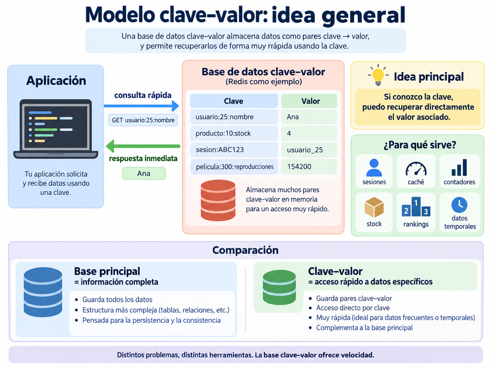
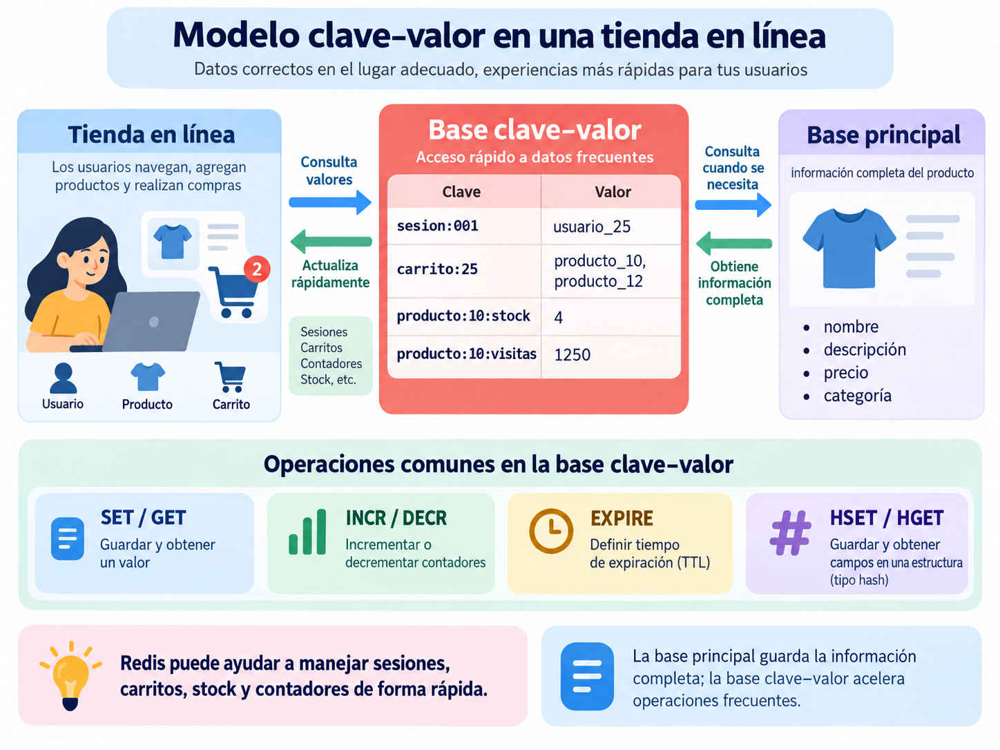

## Introducción

Redis es un sistema de almacenamiento de datos en memoria basado principalmente en el modelo **clave–valor**.

En este modelo, cada dato se identifica mediante una **clave**, la cual permite recuperar rápidamente el valor asociado.

La estructura básica puede representarse así:

```text
clave → valor
```

Por ejemplo:

```text
nombre → "Ana"
ciudad → "Xalapa"
visitas → 10
```

A diferencia de una base documental como MongoDB, donde la información suele organizarse en documentos y colecciones, en Redis el acceso a los datos se realiza principalmente mediante claves.

Además de almacenar valores simples, Redis permite trabajar con diferentes estructuras de datos:

```text
Strings
Hashes
Lists
Sets
Sorted Sets
```

Estas estructuras permiten utilizar Redis en aplicaciones como:

- caché;
- sesiones de usuario;
- contadores;
- control de stock;
- colas de tareas;
- rankings;
- almacenamiento temporal de datos;
- sistemas de mensajería.

## Idea general del modelo clave–valor

Una base de datos clave–valor resulta especialmente útil cuando una aplicación necesita **recuperar o actualizar rápidamente información específica mediante una clave conocida**.

La idea principal puede resumirse de la siguiente manera:

> **Si conozco la clave, puedo recuperar directamente el valor asociado.**

Por ejemplo:

```text
usuario:25:nombre → Ana
producto:10:stock → 4
sesion:ABC123 → usuario_25
pelicula:300:reproducciones → 154200
```

En muchos sistemas, Redis no necesariamente sustituye a la base de datos principal.

Puede utilizarse junto con una base relacional o documental para almacenar información que necesita consultarse o modificarse con mucha frecuencia.

{#fig-clave-valor-general width="100%"}

De manera general, una aplicación puede separar la información de acuerdo con el tipo de operación que necesita realizar:

```text
Base principal
    │
    ├── información completa
    ├── relaciones
    └── datos permanentes

Base clave–valor
    │
    ├── información de acceso rápido
    ├── datos temporales
    ├── contadores
    ├── sesiones
    └── valores que cambian frecuentemente
```

Esto permite comprender que diferentes modelos de bases de datos pueden utilizarse dentro de una misma aplicación para resolver necesidades distintas.

## Ejemplo: tienda en línea

Pensemos en una tienda en línea.

La información completa de un producto podría almacenarse en una base documental o relacional.

Por ejemplo:

```text
Producto
│
├── nombre
├── descripción
├── precio
├── categoría
├── proveedor
└── características
```

Esta información podría encontrarse en MongoDB, PostgreSQL u otra base utilizada como almacenamiento principal.

Sin embargo, dentro de la misma aplicación existen datos que necesitan consultarse o actualizarse constantemente.

Por ejemplo:

```text
sesion:ABC123 → usuario_25
producto:10:stock → 4
producto:10:visitas → 1250
```

Redis puede utilizarse para este tipo de información.

En una tienda en línea podría ayudar a manejar:

- sesiones de usuario;
- carritos de compra;
- control rápido de stock;
- contadores de visitas;
- productos más consultados;
- rankings;
- información temporal.

{#fig-clave-valor-tienda width="100%"}

Por ejemplo, podemos almacenar el stock de un producto:

```bash
SET producto:10:stock 5
```

Para consultar el valor:

```bash
GET producto:10:stock
```

**Resultado esperado:**

> 5

Si se realiza una compra, el stock puede disminuir:

```bash
DECR producto:10:stock
```

Después:

```bash
GET producto:10:stock
```

**Resultado esperado:**

> 4

También se podría llevar un contador de visitas del producto.

```bash
SET producto:10:visitas 0
```

Cada vez que alguien consulta el producto:

```bash
INCR producto:10:visitas
```

De manera conceptual, una tienda podría distribuir la información así:

```text
Tienda en línea
       │
       ├── información completa de productos
       │      MongoDB / PostgreSQL
       │
       ├── sesiones de usuario
       │      Redis
       │
       ├── carrito
       │      Redis
       │
       ├── contador de visitas
       │      Redis
       │
       ├── stock de consulta rápida
       │      Redis
       │
       └── ranking de productos
              Redis
```

Esto muestra una idea importante:

> **Una aplicación puede utilizar diferentes tipos de bases de datos para resolver diferentes necesidades.**

No es necesario elegir únicamente entre MongoDB, PostgreSQL o Redis.

Cada tecnología puede cumplir una función diferente dentro del sistema.

## Ejemplo: plataforma de streaming

Ahora pensemos en una plataforma de streaming.

La información completa de una película o serie podría almacenarse en una base documental.

Por ejemplo:

```text
Película
│
├── título
├── actores
├── género
├── descripción
├── año
└── duración
```

Sin embargo, durante el uso de la aplicación también existe información que cambia constantemente.

Por ejemplo:

```text
usuario:25:ultimo_video → pelicula_300
usuario:25:segundo_actual → 2480
pelicula:300:reproducciones → 154200
sesion:XYZ789 → usuario_25
```

{#fig-clave-valor-streaming width="100%"}

Supongamos que un usuario está viendo una película y se detiene en el segundo 2480.

Ese valor podría almacenarse de forma rápida:

```bash
SET usuario:25:segundo_actual 2480
```

Posteriormente puede recuperarse:

```bash
GET usuario:25:segundo_actual
```

**Resultado esperado:**

> 2480

La aplicación puede utilizar ese valor para continuar la reproducción aproximadamente desde el punto donde el usuario se quedó.

También se puede almacenar cuál fue el último contenido reproducido:

```bash
SET usuario:25:ultimo_video "pelicula_300"
```

Para consultarlo:

```bash
GET usuario:25:ultimo_video
```

**Resultado esperado:**

> "pelicula_300"

Otro ejemplo podría ser un contador de reproducciones:

```bash
SET pelicula:300:reproducciones 154200
```

Cada nueva reproducción puede incrementar el contador:

```bash
INCR pelicula:300:reproducciones
```

De manera conceptual, la aplicación podría organizar la información así:

```text
Plataforma de streaming
       │
       ├── información de películas y series
       │      Base documental
       │
       ├── sesión del usuario
       │      Redis
       │
       ├── último contenido reproducido
       │      Redis
       │
       ├── posición de reproducción
       │      Redis
       │
       └── contadores
              Redis
```

Mientras una base documental puede almacenar una **ficha completa**:

```text
Usuario 25
Nombre: Ana
Edad: 20
Ciudad: Xalapa
```

en un modelo clave–valor podemos acceder directamente a información específica:

```text
usuario:25:nombre → Ana
usuario:25:ciudad → Xalapa
usuario:25:sesion → activa
```

Por esta razón, las bases clave–valor resultan especialmente útiles cuando una aplicación necesita realizar consultas y actualizaciones rápidas sobre información concreta.

## Verificación de conexión

Antes de comenzar a trabajar con Redis, es conveniente comprobar que existe comunicación con el servidor.

Para ello se utiliza:

```bash
PING
```

Si Redis está funcionando correctamente, responde:

> **PONG**

Este comando permite verificar de forma sencilla que el servidor está activo y que el cliente puede comunicarse con él.

## Comandos básicos

Los comandos básicos permiten crear, consultar, verificar y eliminar claves.

### SET

El comando `SET` permite almacenar un valor asociado a una clave.

```bash
SET nombre "Ana"
```

En este ejemplo:

```text
nombre → clave
"Ana"  → valor
```

Si la clave ya existe, `SET` reemplaza el valor anterior.

```bash
SET nombre "Carlos"
```

Ahora la clave `nombre` contiene el valor `"Carlos"`.

### GET

El comando `GET` permite recuperar el valor almacenado en una clave.

```bash
GET nombre
```

**Resultado esperado:**

> "Carlos"

### EXISTS

El comando `EXISTS` permite comprobar si una clave existe.

```bash
EXISTS nombre
```

Si la clave existe, Redis devuelve:

> **1**

Si no existe, devuelve:

> **0**

### DEL

El comando `DEL` permite eliminar una clave.

```bash
DEL nombre
```

Después se puede comprobar que ya no existe:

```bash
GET nombre
```

**Resultado esperado:**

> (nil)

## Strings

Los **strings** son una de las estructuras más simples de Redis.

Permiten almacenar valores como texto, números, identificadores, estados o configuraciones sencillas.

Por ejemplo:

```bash
SET curso "Bases de Datos No Relacionales"
```

Para recuperar el valor:

```bash
GET curso
```

**Resultado esperado:**

> "Bases de Datos No Relacionales"

También es posible modificar el valor utilizando nuevamente `SET`.

```bash
SET curso "Bases NoSQL"
GET curso
```

**Resultado esperado:**

> "Bases NoSQL"

El nuevo valor reemplaza al anterior.

## Contadores

Redis permite realizar operaciones numéricas directamente sobre valores almacenados.

Esto resulta útil para representar:

```text
visitas
likes
intentos
ventas
accesos
cantidades disponibles
```

### INCR

El comando `INCR` incrementa un valor numérico en una unidad.

```bash
SET visitas 10
INCR visitas
```

**Resultado esperado:**

> 11

Si se vuelve a ejecutar:

```bash
INCR visitas
```

el valor aumentará nuevamente en una unidad.

### DECR

El comando `DECR` disminuye un valor numérico en una unidad.

```bash
DECR visitas
```

### INCRBY

`INCRBY` permite incrementar una cantidad específica.

```bash
INCRBY visitas 5
```

En este caso se agregan cinco unidades al valor actual.

### DECRBY

`DECRBY` permite disminuir una cantidad específica.

```bash
DECRBY visitas 3
```

En este caso se restan tres unidades.

### Ejemplo: contador de visitas

```bash
SET pagina:inicio:visitas 0
INCR pagina:inicio:visitas
INCR pagina:inicio:visitas
INCR pagina:inicio:visitas
GET pagina:inicio:visitas
```

**Resultado esperado:**

> 3

## Expiración de claves

Redis permite asignar un **tiempo de vida** a una clave.

Cuando ese tiempo termina, Redis elimina automáticamente la clave.

Esta característica resulta útil para:

- sesiones de usuario;
- códigos de verificación;
- caché;
- tokens;
- información temporal.

Primero se puede crear una clave:

```bash
SET sesion:ABC123 "usuario_25"
```

Después se establece una duración de 60 segundos:

```bash
EXPIRE sesion:ABC123 60
```

Para consultar cuánto tiempo le queda:

```bash
TTL sesion:ABC123
```

`TTL` muestra el número de segundos restantes antes de que la clave expire.

También es posible establecer la expiración al mismo tiempo que se crea la clave:

```bash
SET codigo:verificacion "8472" EX 30
```

En este caso, la clave tendrá una duración de 30 segundos.

Si se desea eliminar la expiración:

```bash
PERSIST codigo:verificacion
```

La clave permanecerá almacenada hasta que sea eliminada manualmente.

## Hashes

Los **hashes** permiten almacenar varios atributos relacionados dentro de una misma clave.

Son útiles para representar entidades como:

```text
productos
usuarios
cuentas
perfiles
configuraciones
```

Por ejemplo, podemos representar un producto mediante la clave:

```text
producto:10
```

Dentro de ella se pueden almacenar campos como:

```text
nombre
precio
stock
```

Para crear el hash:

```bash
HSET producto:10 nombre "Laptop Lenovo" precio 18500 stock 5
```

Para consultar toda la información:

```bash
HGETALL producto:10
```

Redis mostrará los campos `nombre`, `precio` y `stock` junto con sus valores.

Para consultar únicamente el precio:

```bash
HGET producto:10 precio
```

**Resultado esperado:**

> 18500

Para modificar únicamente el stock:

```bash
HSET producto:10 stock 8
```

Después:

```bash
HGET producto:10 stock
```

**Resultado esperado:**

> 8

### HINCRBY

También es posible incrementar o disminuir valores numéricos dentro de un hash.

```bash
HINCRBY producto:10 stock -1
```

Este comando disminuye el stock en una unidad.

Para aumentarlo:

```bash
HINCRBY producto:10 stock 5
```

### HEXISTS

Permite comprobar si un campo existe dentro de un hash.

```bash
HEXISTS producto:10 precio
```

Si existe, Redis devuelve:

> **1**

### HDEL

Permite eliminar un campo de un hash.

```bash
HDEL producto:10 precio
```

## Lists

Las **listas** permiten almacenar varios elementos manteniendo un orden.

Son útiles para representar:

```text
colas
historiales
tareas pendientes
mensajes
procesos
```

### LPUSH

`LPUSH` agrega elementos al inicio de una lista.

```bash
LPUSH tareas "Revisar tarea"
LPUSH tareas "Preparar clase"
LPUSH tareas "Calificar examen"
```

### LRANGE

Permite consultar los elementos de una lista.

```bash
LRANGE tareas 0 -1
```

En este comando:

```text
0  → primer elemento
-1 → último elemento
```

Por lo tanto, se muestran todos los elementos de la lista.

### RPUSH

`RPUSH` agrega elementos al final de una lista.

```bash
RPUSH tareas "Subir calificaciones"
```

### LPOP

Elimina y devuelve el primer elemento de la lista.

```bash
LPOP tareas
```

### RPOP

Elimina y devuelve el último elemento de la lista.

```bash
RPOP tareas
```

### LLEN

Permite conocer la cantidad de elementos existentes.

```bash
LLEN tareas
```

## Sets

Los **sets** almacenan valores sin duplicados.

Son útiles cuando se necesita trabajar con elementos únicos.

Por ejemplo:

```bash
SADD materias "Bases de Datos"
SADD materias "Programación"
SADD materias "Estadística"
```

Para mostrar todos los elementos:

```bash
SMEMBERS materias
```

Si se intenta agregar nuevamente un elemento que ya existe:

```bash
SADD materias "Estadística"
```

Redis no creará un duplicado.

### SISMEMBER

Permite comprobar si un elemento pertenece al conjunto.

```bash
SISMEMBER materias "Programación"
```

Si existe:

> **1**

Si no existe:

> **0**

### SREM

Permite eliminar un elemento.

```bash
SREM materias "Programación"
```

### SCARD

Permite conocer cuántos elementos únicos existen.

```bash
SCARD materias
```

Los sets pueden utilizarse para:

- etiquetas;
- categorías;
- usuarios únicos;
- permisos;
- intereses;
- participantes.

## Sorted Sets

Los **Sorted Sets** funcionan de forma similar a los sets, pero cada elemento tiene asociada una **puntuación**.

Esta puntuación permite ordenar los elementos.

Son útiles para:

```text
rankings
puntuaciones
videojuegos
productos más vendidos
clasificaciones
```

Por ejemplo:

```bash
ZADD ranking 100 "Ana"
ZADD ranking 85 "Carlos"
ZADD ranking 120 "Mariana"
ZADD ranking 95 "Luis"
```

### ZRANGE

Permite mostrar los elementos ordenados de menor a mayor puntuación.

```bash
ZRANGE ranking 0 -1 WITHSCORES
```

### ZREVRANGE

Permite mostrar los elementos de mayor a menor puntuación.

```bash
ZREVRANGE ranking 0 -1 WITHSCORES
```

Para mostrar únicamente los primeros tres lugares:

```bash
ZREVRANGE ranking 0 2 WITHSCORES
```

### ZINCRBY

Permite incrementar la puntuación de un elemento.

```bash
ZINCRBY ranking 20 "Carlos"
```

### ZSCORE

Permite consultar la puntuación de un elemento.

```bash
ZSCORE ranking "Ana"
```

## Consulta y administración de claves

Redis incluye comandos para consultar y administrar las claves existentes.

### TYPE

Permite conocer el tipo de dato asociado a una clave.

```bash
TYPE producto:10
```

**Resultado esperado:**

> hash

### KEYS

Permite buscar claves mediante patrones.

Para mostrar todas las claves:

```bash
KEYS *
```

Para mostrar únicamente las que comienzan con `producto:`:

```bash
KEYS producto:*
```

En bases pequeñas puede resultar útil para explorar los datos.

En bases grandes, `KEYS` puede resultar costoso, por lo que se recomienda utilizar `SCAN`.

### SCAN

`SCAN` permite recorrer las claves de forma progresiva.

```bash
SCAN 0
```

También se pueden utilizar patrones:

```bash
SCAN 0 MATCH producto:*
```

### DBSIZE

Permite conocer cuántas claves existen en la base lógica actual.

```bash
DBSIZE
```

### RENAME

Permite cambiar el nombre de una clave.

```bash
SET materia "Bases NoSQL"
RENAME materia asignatura
GET asignatura
```

**Resultado esperado:**

> "Bases NoSQL"

### MSET

Permite crear varias claves en una sola operación.

```bash
MSET pais "México" estado "Veracruz" municipio "Xalapa"
```

### MGET

Permite recuperar varias claves al mismo tiempo.

```bash
MGET pais estado municipio
```

Redis devolverá los valores asociados a las tres claves.

## Bases lógicas

Redis permite trabajar con diferentes **bases lógicas** dentro de una misma instancia.

Por defecto se utiliza la base:

```bash
SELECT 0
```

Para cambiar a otra base:

```bash
SELECT 1
```

Las claves almacenadas en una base lógica permanecen separadas de las demás.

Por ejemplo:

```bash
SELECT 0
SET ejemplo "Base 0"
```

Después:

```bash
SELECT 1
GET ejemplo
```

Redis no encontrará la clave porque fue almacenada en la base 0.

Ahora se puede crear una clave con el mismo nombre en la base 1:

```bash
SET ejemplo "Base 1"
GET ejemplo
```

**Resultado esperado:**

> "Base 1"

Al regresar a la primera base:

```bash
SELECT 0
GET ejemplo
```

**Resultado esperado:**

> "Base 0"

## Transacciones

Redis permite agrupar varios comandos dentro de una transacción.

La transacción comienza con:

```bash
MULTI
```

Después se agregan los comandos:

```bash
SET cuenta:saldo 1000
DECRBY cuenta:saldo 100
INCRBY cuenta:saldo 50
```

Mientras la transacción está activa, Redis coloca los comandos en espera.

Para ejecutarlos:

```bash
EXEC
```

Después se puede consultar el resultado:

```bash
GET cuenta:saldo
```

**Resultado esperado:**

> 950

También es posible cancelar una transacción.

```bash
MULTI
SET prueba "dato"
INCR contador
DISCARD
```

`DISCARD` elimina los comandos pendientes sin ejecutarlos.

## Pub/Sub

Redis incluye un mecanismo de comunicación llamado **Publish/Subscribe**, conocido como **Pub/Sub**.

En este modelo, un cliente puede suscribirse a un canal y otro cliente puede publicar mensajes.

Para observar su funcionamiento se necesitan dos clientes de Redis.

En el primer cliente:

```bash
SUBSCRIBE noticias
```

El cliente queda escuchando el canal `noticias`.

En un segundo cliente:

```bash
PUBLISH noticias "Nueva clase de Redis"
```

El mensaje será recibido por los clientes suscritos al canal.

También se pueden enviar nuevos mensajes:

```bash
PUBLISH noticias "Examen el viernes"
```

Pub/Sub puede utilizarse en:

- notificaciones;
- mensajería;
- eventos en tiempo real;
- comunicación entre servicios.

## Ejemplos aplicados

### Sesión de usuario

Una sesión temporal puede almacenarse mediante:

```bash
SET sesion:001 "usuario:1" EX 300
```

La sesión tendrá una duración de 300 segundos.

Para consultar cuánto tiempo queda:

```bash
TTL sesion:001
```

### Stock de productos

Un producto puede almacenarse mediante un hash:

```bash
HSET producto:1 nombre "Laptop Lenovo" precio 18500 stock 5
```

Para disminuir el stock:

```bash
HINCRBY producto:1 stock -1
```

Para consultar el nuevo valor:

```bash
HGET producto:1 stock
```

**Resultado esperado:**

> 4

### Contador de visitas

```bash
SET pagina:inicio:visitas 0
INCR pagina:inicio:visitas
INCR pagina:inicio:visitas
INCR pagina:inicio:visitas
GET pagina:inicio:visitas
```

**Resultado esperado:**

> 3

### Cola de pedidos

Se pueden agregar pedidos al final de una lista:

```bash
RPUSH cola:pedidos "pedido_001"
RPUSH cola:pedidos "pedido_002"
RPUSH cola:pedidos "pedido_003"
```

Para consultar la cola:

```bash
LRANGE cola:pedidos 0 -1
```

Para atender el primer pedido:

```bash
LPOP cola:pedidos
```

Después:

```bash
LRANGE cola:pedidos 0 -1
```

mostrará únicamente los pedidos pendientes.

### Usuarios únicos

```bash
SADD publicacion:25:usuarios "usuario1"
SADD publicacion:25:usuarios "usuario2"
SADD publicacion:25:usuarios "usuario3"
SADD publicacion:25:usuarios "usuario1"
```

Aunque `usuario1` se intente agregar dos veces, solo queda almacenado una vez.

Para mostrar los usuarios:

```bash
SMEMBERS publicacion:25:usuarios
```

Para contar usuarios únicos:

```bash
SCARD publicacion:25:usuarios
```

**Resultado esperado:**

> 3

### Ranking

```bash
ZADD ranking 100 "Ana"
ZADD ranking 85 "Carlos"
ZADD ranking 120 "Mariana"
ZADD ranking 95 "Luis"
```

Para mostrar la clasificación:

```bash
ZREVRANGE ranking 0 -1 WITHSCORES
```

Para mostrar únicamente los tres primeros lugares:

```bash
ZREVRANGE ranking 0 2 WITHSCORES
```

### Tienda

Una pequeña tienda puede representar sus productos mediante hashes.

```bash
HSET producto:1 nombre "Laptop Lenovo" precio 18500 stock 5 categoria "Computacion"
HSET producto:2 nombre "Mouse Logitech" precio 650 stock 20 categoria "Accesorios"
HSET producto:3 nombre "Monitor Samsung" precio 4200 stock 8 categoria "Computacion"
```

Para consultar un producto:

```bash
HGETALL producto:1
```

Para consultar únicamente su precio:

```bash
HGET producto:1 precio
```

Para disminuir el stock:

```bash
HINCRBY producto:1 stock -1
```

Para agregar unidades:

```bash
HINCRBY producto:2 stock 10
```

## Buenas prácticas para nombrar claves

Es recomendable utilizar nombres de claves claros y consistentes.

Una estructura común es:

```text
entidad:id:campo
```

Por ejemplo:

```text
usuario:25:nombre
producto:10:stock
pagina:inicio:visitas
sesion:ABC123
```

El uso de `:` ayuda a organizar visualmente las claves y permite identificar fácilmente a qué entidad pertenecen.

También es recomendable:

- utilizar nombres descriptivos;
- mantener una estructura consistente;
- evitar claves excesivamente largas;
- utilizar identificadores claros;
- separar entidades mediante `:`.

Otros ejemplos:

```text
universidad:estudiante:1001:nombre
tienda:producto:25:stock
```

## Información del servidor

Redis permite consultar información sobre la instancia que se encuentra funcionando.

Para obtener información general:

```bash
INFO
```

Para consultar información específica del servidor:

```bash
INFO server
```

Para consultar información relacionada con el uso de memoria:

```bash
INFO memory
```

Para conocer información sobre los clientes conectados:

```bash
INFO clients
```

## Limpieza de datos

Redis permite eliminar todas las claves de una base lógica.

Para eliminar únicamente las claves de la base actual:

```bash
FLUSHDB
```

Para eliminar todas las claves de todas las bases lógicas:

```bash
FLUSHALL
```

::: {.callout-warning}
## Precaución

Los comandos `FLUSHDB` y `FLUSHALL` eliminan datos.

Deben utilizarse con precaución y principalmente en bases de prueba.
:::

## Resumen de estructuras

| Estructura | Uso principal | Ejemplo |
|---|---|---|
| `STRING` | Valores simples, contadores y sesiones | `SET nombre "Ana"` |
| `HASH` | Objetos con varios campos | `HSET producto:1 nombre "Laptop" precio 18500` |
| `LIST` | Colas, historiales y tareas | `RPUSH cola:pedidos "pedido_001"` |
| `SET` | Valores únicos | `SADD materias "Estadística"` |
| `SORTED SET` | Rankings y puntuaciones | `ZADD ranking 100 "Ana"` |

## Resumen de comandos principales

La siguiente tabla resume los comandos revisados y su función principal.

| Comando | Función |
|---|---|
| `PING` | Comprueba si existe comunicación con el servidor Redis. |
| `SET` | Guarda un valor asociado a una clave. |
| `GET` | Recupera el valor almacenado en una clave. |
| `DEL` | Elimina una clave. |
| `EXISTS` | Comprueba si una clave existe. |
| `INCR` | Incrementa en una unidad un valor numérico. |
| `DECR` | Disminuye en una unidad un valor numérico. |
| `INCRBY` | Incrementa un valor numérico en una cantidad específica. |
| `DECRBY` | Disminuye un valor numérico en una cantidad específica. |
| `EXPIRE` | Asigna un tiempo de vida a una clave. |
| `TTL` | Muestra cuánto tiempo le queda a una clave antes de expirar. |
| `PERSIST` | Elimina la expiración de una clave. |
| `HSET` | Crea o modifica campos dentro de un hash. |
| `HGET` | Recupera un campo específico de un hash. |
| `HGETALL` | Muestra todos los campos y valores de un hash. |
| `HEXISTS` | Comprueba si un campo existe dentro de un hash. |
| `HDEL` | Elimina un campo dentro de un hash. |
| `HINCRBY` | Incrementa o disminuye un campo numérico dentro de un hash. |
| `LPUSH` | Agrega un elemento al inicio de una lista. |
| `RPUSH` | Agrega un elemento al final de una lista. |
| `LRANGE` | Muestra un rango de elementos de una lista. |
| `LPOP` | Elimina y devuelve el primer elemento de una lista. |
| `RPOP` | Elimina y devuelve el último elemento de una lista. |
| `LLEN` | Muestra la cantidad de elementos de una lista. |
| `SADD` | Agrega elementos a un conjunto. |
| `SMEMBERS` | Muestra todos los elementos de un conjunto. |
| `SISMEMBER` | Comprueba si un elemento pertenece a un conjunto. |
| `SREM` | Elimina un elemento de un conjunto. |
| `SCARD` | Muestra la cantidad de elementos de un conjunto. |
| `ZADD` | Agrega elementos y puntuaciones a un Sorted Set. |
| `ZRANGE` | Muestra elementos ordenados de menor a mayor puntuación. |
| `ZREVRANGE` | Muestra elementos ordenados de mayor a menor puntuación. |
| `ZINCRBY` | Incrementa la puntuación de un elemento. |
| `ZSCORE` | Consulta la puntuación de un elemento. |
| `TYPE` | Muestra el tipo de dato asociado a una clave. |
| `KEYS` | Busca claves que coincidan con un patrón. |
| `SCAN` | Recorre las claves de forma progresiva. |
| `DBSIZE` | Muestra cuántas claves existen en la base actual. |
| `RENAME` | Cambia el nombre de una clave. |
| `MSET` | Guarda varias claves y valores en una sola operación. |
| `MGET` | Recupera varias claves en una sola operación. |
| `SELECT` | Cambia de base lógica. |
| `MULTI` | Inicia una transacción. |
| `EXEC` | Ejecuta los comandos pendientes de una transacción. |
| `DISCARD` | Cancela una transacción. |
| `SUBSCRIBE` | Suscribe un cliente a un canal. |
| `PUBLISH` | Publica un mensaje en un canal. |
| `INFO` | Muestra información sobre el servidor Redis. |
| `FLUSHDB` | Elimina todas las claves de la base lógica actual. |
| `FLUSHALL` | Elimina todas las claves de todas las bases lógicas. |