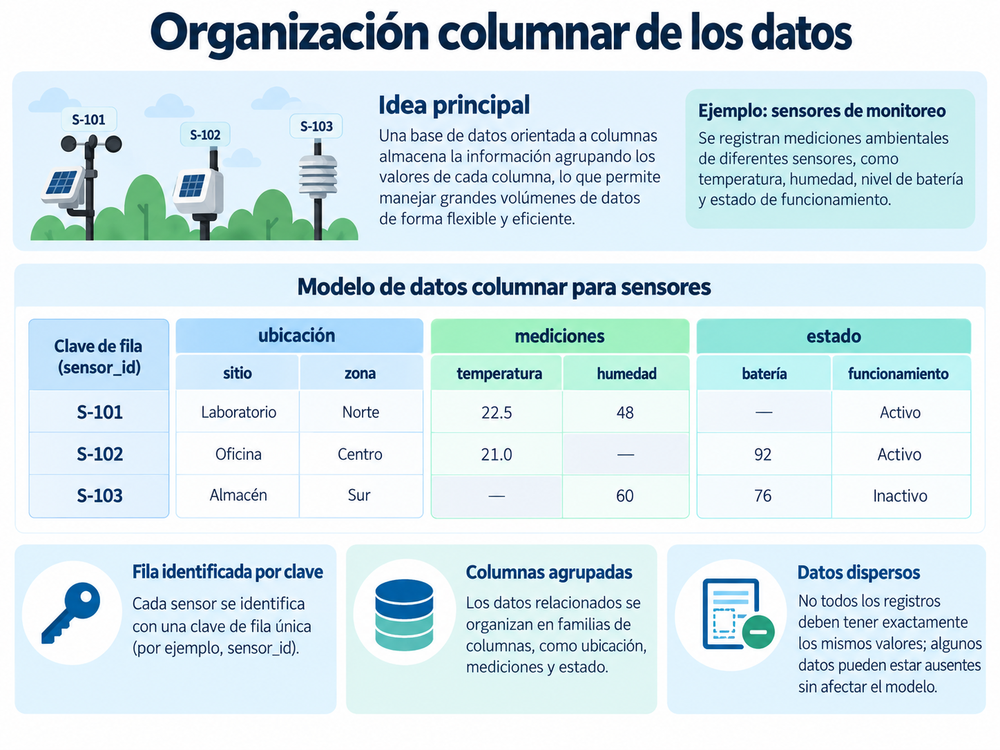
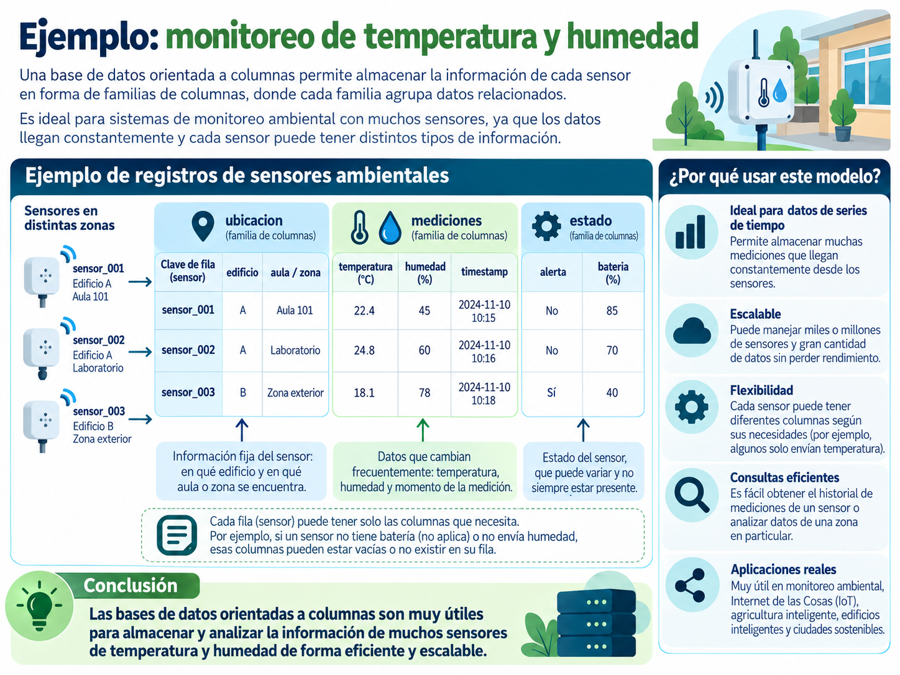

## Introducción

Las bases de datos de **familias de columnas**, también conocidas como bases de datos de **columnas amplias** (*wide-column*), constituyen un modelo de bases de datos no relacionales diseñado para organizar grandes cantidades de información y facilitar su distribución entre diferentes servidores.

Aunque utilizan conceptos como filas y columnas, su organización no necesariamente sigue la misma lógica de una base de datos relacional.

Para comprender su funcionamiento, utilizaremos como ejemplo un sistema de **monitoreo ambiental** que registra constantemente información proveniente de sensores instalados en diferentes edificios de una universidad.

Cada sensor puede generar datos como:

- Temperatura.
- Humedad.
- Ubicación.
- Estado del dispositivo.
- Fecha y hora de cada medición.

A partir de este ejemplo estudiaremos cómo se organiza la información, qué son las familias de columnas y cómo funcionan conceptos como el **particionamiento** y la **escalabilidad horizontal**.

---

## ¿Qué son las bases de datos de familias de columnas?

Las bases de datos de familias de columnas organizan la información mediante filas identificadas por una clave y columnas que pueden representar diferentes características de los registros.

Este modelo está presente en tecnologías como:

- Apache Cassandra.
- Apache HBase.
- Google Bigtable.

Aunque pertenecen a una misma familia general, cada una implementa el modelo de manera diferente.

Imaginemos una universidad que cuenta con sensores ambientales instalados en diferentes edificios.

Uno de estos sensores podría registrar la siguiente información:

```text
sensor_001
    edificio: A
    aula: 101
    temperatura: 22.4
    humedad: 45
    bateria: 85
```

Toda esta información corresponde al dispositivo identificado como `sensor_001`.

En algunos sistemas de familias de columnas, los registros pueden contener diferentes conjuntos de información. Por ejemplo, algunos sensores podrían registrar temperatura y humedad, mientras que otros únicamente temperatura.

::: {.callout-note}
## Idea principal

El modelo de familias de columnas permite organizar grandes cantidades de información mediante claves de fila, columnas y estructuras diseñadas para distribuir los datos entre diferentes servidores.
:::

---

## ¿Cómo se organiza la información?

Para comprender este modelo podemos identificar tres elementos generales:

- Clave de fila.
- Columnas.
- Familias de columnas.

### Clave de fila

La **clave de fila** (*row key*) permite identificar un registro.

Por ejemplo, nuestro sistema podría tener los siguientes sensores:

```text
sensor_001
sensor_002
sensor_003
```

Cada identificador corresponde a un dispositivo diferente.

A partir de esta clave es posible localizar la información asociada con cada sensor.

### Columnas

Las columnas representan características o datos asociados con cada registro.

Por ejemplo:

```text
sensor_001
    edificio: A
    aula: 101
    temperatura: 22.4
    humedad: 45
```

En este caso, las columnas contienen información sobre la ubicación del dispositivo y las condiciones ambientales registradas.

### Familias de columnas

Una **familia de columnas** representa una agrupación lógica de columnas relacionadas.

Siguiendo nuestro ejemplo, podemos imaginar tres grupos de información.

**Ubicación**

```text
ubicacion
    edificio: A
    aula: 101
```

**Mediciones**

```text
mediciones
    temperatura: 22.4
    humedad: 45
```

**Estado**

```text
estado
    bateria: 85
    alerta: No
```

Esta representación nos permite comprender conceptualmente cómo puede agruparse información relacionada.

Sin embargo, la implementación concreta depende de la tecnología utilizada.

Por ejemplo, **HBase trabaja explícitamente con familias de columnas**, mientras que **Cassandra organiza la información mediante tablas, particiones, filas y columnas definidas en un esquema**.

::: {.callout-important}
## No es una tabla relacional tradicional

Aunque Cassandra utiliza tablas, filas y columnas, su diseño no sigue exactamente la misma lógica que una base de datos relacional.

En Cassandra, las tablas se diseñan principalmente considerando las consultas que la aplicación necesita realizar.
:::

---

## Ejemplo de organización

Consideremos nuevamente nuestro sistema de monitoreo ambiental.

Cada sensor se identifica mediante una clave y registra distintos tipos de información relacionados con su ubicación, sus mediciones y el estado del dispositivo.

{#fig-organizacion-columnas width="100%"}

La @fig-organizacion-columnas muestra conceptualmente tres sensores con diferentes características.

Algunos dispositivos pueden registrar temperatura y humedad, mientras que otros podrían no generar todas las variables disponibles.

Esta situación permite introducir el concepto de **datos dispersos**.

### ¿Qué son los datos dispersos?

Los datos dispersos son conjuntos de información en los que no todos los registros contienen valores para todas las columnas posibles.

Por ejemplo:

| Sensor | Temperatura | Humedad | Batería |
|---|---:|---:|---:|
| sensor_001 | 22.4 | 45 | 85 |
| sensor_002 | 24.8 | 60 | |
| sensor_003 | 18.1 | | 40 |

El segundo sensor no reportó información sobre su batería y el tercero no registró humedad.

En determinados sistemas de familias de columnas, los datos ausentes no necesitan almacenarse como valores individuales.

Esto puede resultar útil cuando se trabaja con dispositivos que tienen diferentes capacidades o producen distintos tipos de información.

::: {.callout-important}
## Una distinción importante

No todos los sistemas de familias de columnas permiten agregar libremente cualquier columna a cada registro.

En Cassandra, las columnas ordinarias deben definirse mediante un esquema.

Por esta razón, debemos distinguir entre las características generales del modelo y la implementación específica de cada tecnología.
:::

---

## Diferencias respecto al modelo relacional

Las bases de datos relacionales y las bases de datos de familias de columnas pueden representar información mediante filas y columnas.

Sin embargo, existen diferencias importantes en la forma en que se diseñan, distribuyen y consultan los datos.

Consideremos nuevamente nuestro sistema de monitoreo ambiental.

En una base de datos relacional podríamos tener una tabla como la siguiente:

| Sensor | Edificio | Temperatura | Humedad |
|---|---|---:|---:|
| sensor_001 | A | 22.4 | 45 |
| sensor_002 | A | 24.8 | 60 |
| sensor_003 | B | 18.1 | 78 |

Si necesitamos conservar el historial de mediciones, podríamos crear otra tabla y relacionarla con la información de los sensores.

Por ejemplo:

```text
SENSORES
------------------------
sensor_id
edificio
aula

MEDICIONES
------------------------
medicion_id
sensor_id
fecha_hora
temperatura
humedad
```

En un sistema de familias de columnas, la organización depende de la tecnología utilizada y de las consultas que necesitamos realizar.

En Cassandra, por ejemplo, podríamos diseñar una tabla específicamente para recuperar las mediciones de un sensor durante una fecha determinada.

La siguiente tabla resume algunas diferencias generales:

| Característica | Modelo relacional | Familias de columnas |
|---|---|---|
| Organización | Tablas relacionadas | Filas, columnas y estructuras según la tecnología |
| Esquema | Generalmente definido | Depende del sistema |
| Relaciones | Llaves foráneas y `JOIN` | Generalmente se evitan relaciones complejas |
| Diseño | Basado en entidades y relaciones | Puede orientarse a las consultas |
| Distribución | Depende del gestor | Algunos sistemas están diseñados para múltiples nodos |
| Ejemplos | PostgreSQL, MySQL | Cassandra, HBase |

Estas diferencias no significan que un modelo sea mejor que otro.

Cada uno responde a necesidades diferentes.

Por ejemplo, un sistema universitario que administra estudiantes, materias, inscripciones y calificaciones puede funcionar adecuadamente mediante una base de datos relacional.

En cambio, una aplicación que recibe constantemente millones de mediciones provenientes de sensores puede beneficiarse de una base de datos distribuida diseñada para manejar grandes volúmenes de escritura.

::: {.callout-tip}
## Para recordar

La elección de una base de datos depende del tipo de información que necesitamos almacenar, de la cantidad de datos y de las consultas que realizará la aplicación.
:::

---

## Distribución y escalabilidad horizontal

Una característica importante de sistemas como Cassandra es su capacidad para distribuir información entre diferentes servidores.

Para comprenderlo, imaginemos que nuestra universidad comienza con únicamente diez sensores.

Cada sensor registra información cada cinco minutos.

Con el tiempo, el proyecto crece y se instalan:

```text
10 sensores
100 sensores
1,000 sensores
10,000 sensores
```

Cada uno genera nuevas mediciones constantemente.

La cantidad de información comienza a crecer rápidamente.

Una forma de afrontar este crecimiento consiste en aumentar los recursos del servidor.

### Escalabilidad vertical

La **escalabilidad vertical** consiste en aumentar los recursos disponibles en un mismo servidor.

Por ejemplo:

- Incrementar la memoria RAM.
- Incorporar un procesador más potente.
- Aumentar la capacidad de almacenamiento.

Podemos representarlo de la siguiente manera:

```text
Servidor

RAM: 8 GB
      ↓
RAM: 16 GB
      ↓
RAM: 32 GB
```

Esta estrategia puede ser útil, pero existe un límite físico y económico para el crecimiento de una sola máquina.

### Escalabilidad horizontal

La **escalabilidad horizontal** consiste en incorporar servidores adicionales para distribuir el trabajo.

Por ejemplo:

```text
                  Aplicación
                       |
          -------------------------
          |           |           |
        Nodo 1      Nodo 2      Nodo 3
          |           |           |
          -------------------------
                       |
              Datos distribuidos
```

En este escenario, diferentes nodos participan en el almacenamiento y procesamiento de la información.

Si las necesidades del sistema aumentan, podrían agregarse más nodos.

```text
Nodo 1
Nodo 2
Nodo 3
Nodo 4
Nodo 5
```

Esta capacidad es especialmente importante en aplicaciones que generan grandes cantidades de información.

Sin embargo, agregar servidores no garantiza automáticamente un mejor rendimiento.

También influyen factores como:

- La forma en que se distribuyen los datos.
- El diseño de las consultas.
- La configuración del sistema.
- La capacidad de cada nodo.

::: {.callout-tip}
## Para recordar

**Escalabilidad vertical:** aumentar los recursos de un servidor.

**Escalabilidad horizontal:** incorporar más servidores para distribuir el trabajo.
:::

---

## Clúster y nodos

En una base de datos distribuida como Cassandra, diferentes servidores pueden trabajar de manera conjunta.

Cada servidor que forma parte del sistema se denomina **nodo**.

Un conjunto de nodos que trabajan de manera coordinada forma un **clúster**.

Por ejemplo:

```text
                Clúster de Cassandra

        ┌──────────┐
        │  Nodo 1  │
        └──────────┘

        ┌──────────┐
        │  Nodo 2  │
        └──────────┘

        ┌──────────┐
        │  Nodo 3  │
        └──────────┘
```

Los datos pueden distribuirse entre los diferentes nodos del clúster.

Esto nos lleva a una pregunta importante:

> ¿Cómo determina el sistema qué datos deben almacenarse juntos y cómo distribuirlos entre los nodos?

Para comprenderlo necesitamos estudiar el **particionamiento**.

---

## Particionamiento de los datos

Cuando una base de datos utiliza varios servidores necesita determinar cómo distribuir la información entre ellos.

El **particionamiento** consiste en dividir los datos en conjuntos que puedan almacenarse y procesarse de manera distribuida.

Imaginemos nuevamente nuestro sistema de sensores.

Podemos tener miles de dispositivos generando mediciones constantemente.

Una posible estrategia consiste en agrupar las mediciones utilizando:

- El identificador del sensor.
- La fecha de las mediciones.

Por ejemplo:

```text
(sensor_001, 2026-10-01)

(sensor_001, 2026-10-02)

(sensor_002, 2026-10-01)

(sensor_002, 2026-10-02)
```

Cada combinación agrupa las mediciones de un sensor correspondientes a un día determinado.

Podríamos visualizarlo de la siguiente manera:

```text
(sensor_001, 2026-10-01)
    10:00   22.4 °C   45 %
    10:05   22.8 °C   46 %
    10:10   23.1 °C   47 %

(sensor_002, 2026-10-01)
    10:00   24.8 °C   60 %
    10:05   25.0 °C   61 %
```

De esta manera, las mediciones correspondientes al mismo sensor y fecha se encuentran agrupadas.

En Cassandra, la **clave de partición** determina cómo se distribuyen los datos entre los nodos del clúster.

Conceptualmente podríamos tener:

```text
Clave de partición

(sensor_id, fecha)
```

Por ejemplo:

```text
(sensor_001, 2026-10-01)
(sensor_001, 2026-10-02)
(sensor_002, 2026-10-01)
```

Cada una representa una partición diferente.

### ¿Por qué es importante la clave de partición?

Una buena clave de partición ayuda a distribuir los datos de manera adecuada.

Una mala elección puede provocar que demasiados registros se concentren en una misma partición o que determinadas partes del sistema reciban demasiadas solicitudes.

Por esta razón, en Cassandra debemos pensar desde el inicio:

> ¿Qué información necesito consultar?

Por ejemplo, si frecuentemente necesitamos responder:

> ¿Cuáles fueron las mediciones del sensor 001 durante el 1 de octubre?

Entonces organizar la información mediante el sensor y la fecha puede resultar conveniente.

::: {.callout-important}
## Una idea fundamental de Cassandra

En Cassandra normalmente primero pensamos en las consultas que realizará la aplicación y después diseñamos las tablas necesarias para responderlas eficientemente.
:::

---

## Ejemplo aplicado: monitoreo de temperatura y humedad

Imaginemos que una universidad instala sensores ambientales en diferentes edificios.

Cada dispositivo registra periódicamente información sobre las condiciones del lugar donde se encuentra.

Los sensores pueden generar los siguientes datos:

- Identificador del sensor.
- Edificio.
- Aula o zona.
- Temperatura.
- Humedad.
- Fecha y hora de la medición.
- Estado del dispositivo.

{#fig-monitoreo-ambiental width="100%"}

La @fig-monitoreo-ambiental representa conceptualmente cómo puede organizarse la información generada por diferentes sensores.

### Información del dispositivo

Cada sensor necesita un identificador y una ubicación.

Por ejemplo:

```text
sensor_001
    edificio: A
    aula: 101
```

Estos datos permiten identificar dónde se encuentra instalado el dispositivo.

### Información de las mediciones

Un mismo sensor puede generar múltiples registros durante el día.

Por ejemplo:

| Sensor | Hora | Temperatura | Humedad |
|---|---|---:|---:|
| sensor_001 | 10:00 | 22.4 | 45 |
| sensor_001 | 10:05 | 22.8 | 46 |
| sensor_001 | 10:10 | 23.1 | 47 |
| sensor_002 | 10:00 | 24.8 | 60 |
| sensor_002 | 10:05 | 25.0 | 61 |

Observa que un sensor no genera una única temperatura.

Produce nuevas mediciones conforme transcurre el tiempo.

Por lo tanto, necesitamos una estructura que permita conservar el **historial de mediciones** y no solamente la última lectura recibida.

Por ejemplo:

```text
sensor_001

10:00 → 22.4 °C
10:05 → 22.8 °C
10:10 → 23.1 °C
```

Esta característica será importante cuando trabajemos posteriormente con Apache Cassandra.

---

## ¿Qué consultas podríamos realizar?

Antes de diseñar una base de datos es importante identificar las consultas que realizará la aplicación.

Nuestro sistema de monitoreo ambiental podría necesitar responder preguntas como:

1. ¿Cuáles fueron las mediciones del sensor 001 durante una fecha determinada?
2. ¿Qué temperatura registró un sensor durante las últimas horas?
3. ¿En qué momento se alcanzó determinada temperatura?
4. ¿Qué registros históricos necesitamos recuperar para realizar un análisis?

Estas preguntas influyen en la forma en que organizaremos los datos.

Por ejemplo, si utilizamos Cassandra, podríamos organizar las mediciones mediante:

```text
sensor + fecha
```

y posteriormente ordenar las diferentes lecturas mediante la hora.

Conceptualmente:

```text
(sensor_001, 2026-10-01)

    10:00
    10:05
    10:10
    10:15
```

Esto permitiría recuperar fácilmente el historial de un dispositivo durante un periodo determinado.

::: {.callout-note}
## Una consideración sobre el ejemplo

Las figuras utilizadas en este apunte representan conceptualmente las características del modelo de familias de columnas.

Cuando trabajemos específicamente con Cassandra utilizaremos tablas, claves de partición y columnas de agrupamiento para almacenar múltiples mediciones de cada sensor.
:::

---

## Ventajas del modelo

Los sistemas de familias de columnas pueden ofrecer diferentes ventajas dependiendo de la tecnología utilizada y del problema que se desea resolver.

### Distribución de la información

Tecnologías como Cassandra están diseñadas para trabajar con varios nodos.

Esto permite distribuir los datos entre diferentes servidores.

### Escalabilidad horizontal

El sistema puede incorporar nodos adicionales cuando aumentan las necesidades de almacenamiento o procesamiento.

### Manejo de grandes volúmenes de datos

Este tipo de sistemas puede utilizarse en aplicaciones que generan grandes cantidades de registros.

Por ejemplo:

- Sistemas de monitoreo.
- Sensores IoT.
- Registros de eventos.
- Aplicaciones distribuidas.
- Plataformas con grandes volúmenes de escritura.

### Organización orientada a las consultas

En Cassandra, las tablas se diseñan considerando las consultas que la aplicación necesita realizar.

Este enfoque es diferente al utilizado normalmente en el diseño de bases de datos relacionales.

---

## Limitaciones y consideraciones

El modelo también presenta aspectos que debemos considerar.

### Diseño de las consultas

En Cassandra es importante conocer anticipadamente las consultas que realizará la aplicación.

No conviene diseñar las tablas como si fueran tablas relacionales que posteriormente serán combinadas mediante numerosos `JOIN`.

### Claves de partición

Una mala elección de la clave de partición puede generar una distribución poco equilibrada de los datos.

También puede producir particiones demasiado grandes o concentrar demasiadas solicitudes en determinadas partes del sistema.

### Relaciones entre entidades

Cuando una aplicación requiere realizar relaciones complejas entre muchas entidades o ejecutar consultas muy variables, otros modelos de bases de datos pueden resultar más apropiados.

### Complejidad operativa

Trabajar con sistemas distribuidos implica comprender conceptos adicionales.

Por ejemplo:

- Nodos.
- Particiones.
- Replicación.
- Disponibilidad.
- Consistencia.

Por esta razón, la elección de una tecnología debe considerar las necesidades reales de la aplicación.

---

## Tecnologías representativas

Dentro de las bases de datos de familias de columnas encontramos diferentes tecnologías.

### Apache Cassandra

Apache Cassandra es una base de datos NoSQL distribuida que utiliza un modelo de columnas amplias.

Está diseñada para distribuir información entre varios nodos y trabajar con grandes volúmenes de datos.

Utiliza un lenguaje de consultas llamado **CQL** (*Cassandra Query Language*).

En las siguientes clases utilizaremos Cassandra para:

- Crear espacios de claves.
- Crear tablas.
- Insertar registros.
- Consultar información.
- Trabajar con claves de partición.
- Organizar historiales de mediciones.

### Apache HBase

Apache HBase es una base de datos distribuida inspirada en el modelo de Google Bigtable.

Utiliza claves de fila y familias de columnas y forma parte del ecosistema de Apache Hadoop.

### Google Bigtable

Google Bigtable es un servicio de base de datos de columnas amplias administrado por Google Cloud.

Está diseñado para almacenar grandes cantidades de información y atender aplicaciones que necesitan trabajar con datos a gran escala.

| Tecnología | Característica general |
|---|---|
| Apache Cassandra | Base de datos distribuida de columnas amplias |
| Apache HBase | Almacenamiento distribuido con familias de columnas |
| Google Bigtable | Servicio administrado de columnas amplias |

Aunque pertenecen a una misma familia general, estas tecnologías presentan diferencias importantes en su arquitectura, modelo de datos y forma de realizar consultas.

---

## Relación con los modelos anteriores

Hasta ahora hemos estudiado tres modelos principales de bases de datos no relacionales.

| Modelo | Organización principal | Ejemplo |
|---|---|---|
| Documental | Documentos con campos y valores | MongoDB |
| Clave–valor | Claves asociadas con valores | Redis |
| Familias de columnas | Filas y columnas organizadas según el sistema | Cassandra |

Estos modelos no son necesariamente excluyentes.

Una misma aplicación puede utilizar diferentes tecnologías cuando cada una responde a una necesidad específica.

Por ejemplo, en nuestro sistema de monitoreo ambiental podríamos utilizar:

**MongoDB**

```text
Información general de los sensores
```

**Redis**

```text
Última temperatura registrada
```

**Cassandra**

```text
Historial de miles o millones de mediciones
```

Podemos representarlo de la siguiente manera:

```text
Aplicación de monitoreo
         |
 -------------------------
 |           |           |
MongoDB    Redis     Cassandra
 |           |           |
Datos      Datos      Historial
generales  rápidos    de mediciones
```

La decisión debe basarse en las necesidades de almacenamiento, consulta y procesamiento de la aplicación.

---