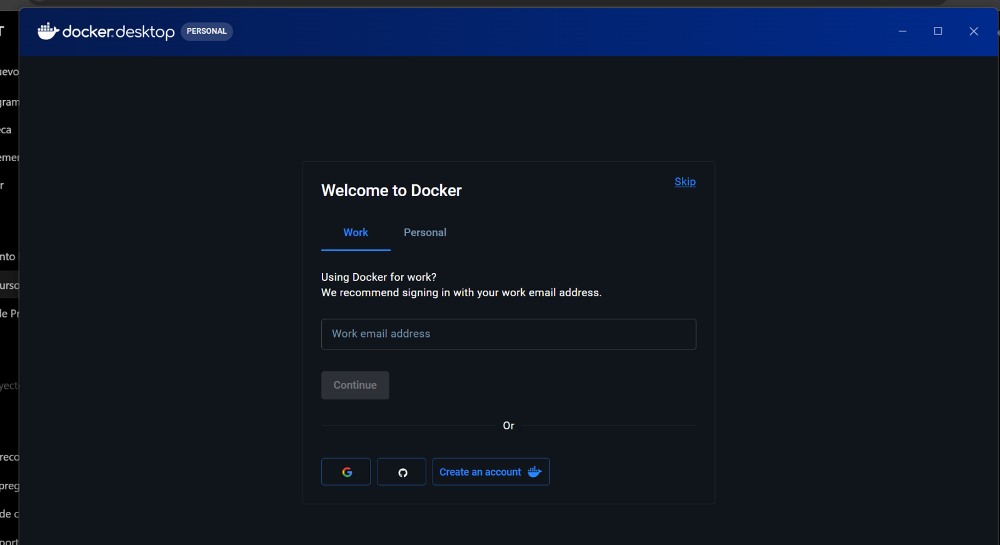
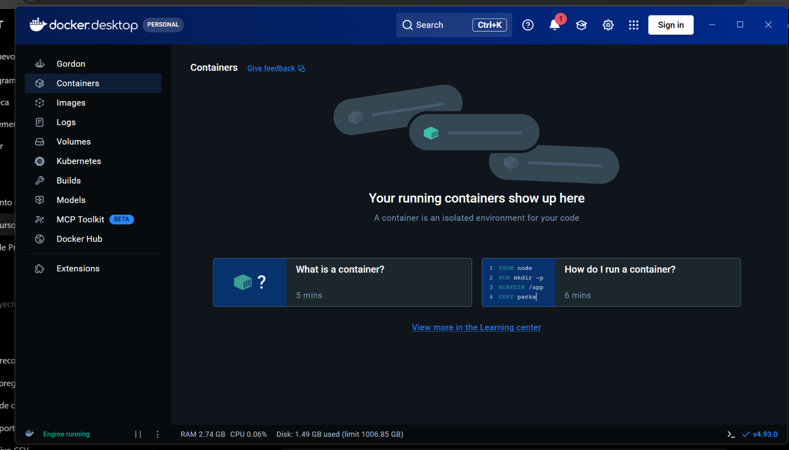
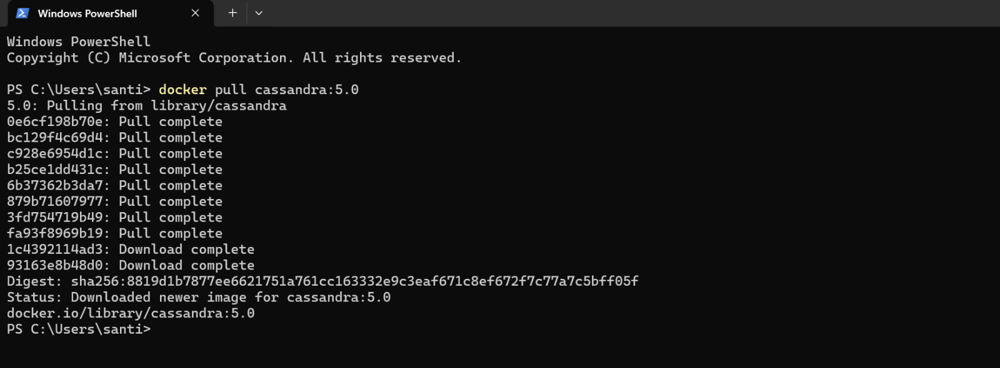
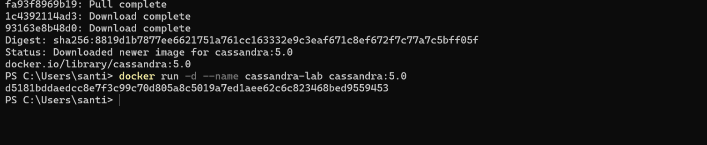
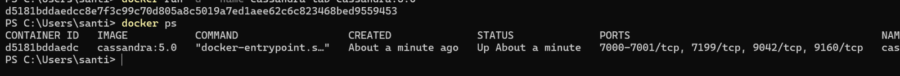
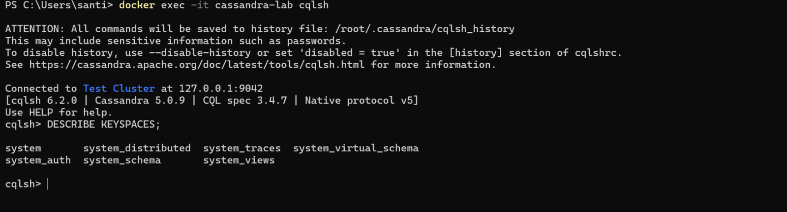
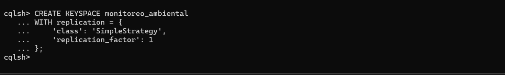
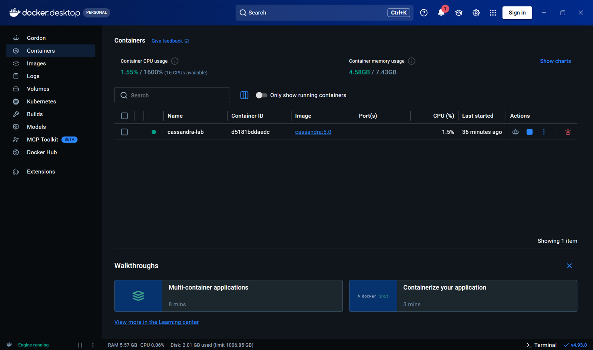

## Objetivo

Instalar y ejecutar **Apache Cassandra en Windows** mediante Docker Desktop, comprobar que el servicio funciona y realizar una primera prueba con el lenguaje CQL (*Cassandra Query Language*).

Este manual documenta el procedimiento utilizado en clase con Docker Desktop y la imagen `cassandra:5.0`. Las capturas muestran un ejemplo de instalación; algunos botones pueden cambiar de ubicación entre versiones.

## Requisitos

- Windows 10 u 11 compatible con Docker Desktop.
- Virtualización habilitada y WSL 2 correctamente configurado.
- Al menos 8 GB de RAM como referencia práctica; disponer de más memoria facilita el trabajo simultáneo con otras aplicaciones.
- Conexión a Internet para descargar Docker y Cassandra.

::: {.callout-note}
## ¿Qué vamos a instalar?
Docker Desktop administra el contenedor. Dentro de ese contenedor se ejecuta Cassandra. Para crear tablas y consultar los datos utilizaremos `cqlsh`, la consola de Cassandra. No es necesario instalar Java de forma independiente para este procedimiento.
:::

## Descargar e iniciar Docker Desktop

Accede a la [página oficial de instalación de Docker Desktop para Windows](https://docs.docker.com/desktop/setup/install/windows-install/). Descarga la versión que corresponda al procesador de tu computadora y ejecuta el instalador.

Si el instalador solicita actualizar WSL o reiniciar Windows, completa esos pasos antes de continuar. Abre Docker Desktop desde el menú Inicio.

### Aceptar los términos

En el primer inicio, Docker muestra el acuerdo de suscripción. Revisa los términos y selecciona **Accept** si estás de acuerdo.

{#fig-docker-aceptar width="100%"}

### Continuar sin iniciar sesión

En la pantalla de bienvenida puedes seleccionar **Skip** si no necesitas iniciar sesión para este ejercicio.

{#fig-docker-bienvenida width="100%"}

### Verificar que Docker está funcionando

En la ventana principal, comprueba que en la parte inferior izquierda aparezca el indicador **Engine running**.

{#fig-docker-running width="100%"}

## Descargar Apache Cassandra

Abre **PowerShell** desde el menú Inicio de Windows. Para comprobar que Docker está disponible, ejecuta:

```powershell
docker --version
```

Ahora descarga la imagen de Cassandra:

```powershell
docker pull cassandra:5.0
```

Espera hasta que aparezca el mensaje `Downloaded newer image for cassandra:5.0` o un mensaje indicando que la imagen ya está actualizada.

{#fig-cassandra-descarga width="100%"}

## Crear e iniciar el contenedor

Ejecuta el siguiente comando **una sola vez** para crear el contenedor de la práctica:

```powershell
docker run -d --name cassandra-lab cassandra:5.0
```

Docker devolverá un identificador largo. Eso indica que creó el contenedor; todavía debemos comprobar que Cassandra terminó de iniciar.

{#fig-cassandra-run width="100%"}

### Comprobar el estado

Ejecuta:

```powershell
docker ps
```

Comprueba que aparezca `cassandra-lab` con un estado que comience por `Up`.

{#fig-cassandra-ps width="100%"}

::: {.callout-tip}
## Esperar al arranque
Aunque el estado sea `Up`, el primer arranque de Cassandra puede tardar varios minutos. Si el siguiente paso presenta un error de conexión, espera un poco y vuelve a intentarlo.
:::

## Entrar a la consola de Cassandra

En PowerShell, escribe:

```powershell
docker exec -it cassandra-lab cqlsh
```

Cuando aparezca el indicador `cqlsh>`, la conexión está lista. Para ver los espacios de claves disponibles, ejecuta:

```sql
DESCRIBE KEYSPACES;
```

El resultado incluirá espacios internos como `system`, `system_schema` y `system_auth`.

{#fig-cassandra-cqlsh width="100%"}

## Primera prueba: crear un keyspace

Un *keyspace* es el espacio lógico donde organizaremos nuestras tablas. Para este curso utilizaremos el ejemplo de sensores ambientales.

Escribe lo siguiente **dentro de `cqlsh`**, no en PowerShell:

```sql
CREATE KEYSPACE monitoreo_ambiental
WITH replication = {
    'class': 'SimpleStrategy',
    'replication_factor': 1
};
```

Esta configuración se utiliza únicamente para nuestra práctica de **un nodo**. No es una configuración recomendada para producción.

{#fig-cassandra-keyspace width="100%"}

Selecciona el keyspace:

```sql
USE monitoreo_ambiental;
```

El indicador cambiará a `cqlsh:monitoreo_ambiental>`.

## Comprobar que podemos guardar y consultar datos

Crea una tabla sencilla para identificar los sensores:

```sql
CREATE TABLE sensores (
    sensor_id TEXT PRIMARY KEY,
    edificio TEXT,
    aula TEXT,
    tipo TEXT
);
```

Registra tres dispositivos:

```sql
INSERT INTO sensores (sensor_id, edificio, aula, tipo)
VALUES ('sensor_001', 'A', '101', 'Temperatura y humedad');

INSERT INTO sensores (sensor_id, edificio, aula, tipo)
VALUES ('sensor_002', 'A', 'Laboratorio', 'Temperatura y humedad');

INSERT INTO sensores (sensor_id, edificio, aula, tipo)
VALUES ('sensor_003', 'B', 'Exterior', 'Temperatura');
```

Comprueba los resultados:

```sql
SELECT * FROM sensores;
```

Deberían aparecer tres filas. **El orden puede variar**, ya que Cassandra no garantiza el orden de presentación sin una consulta diseñada para ello.

::: {.callout-note}
## Alcance de esta primera prueba
Esta tabla almacena información general sobre cada sensor. En una práctica posterior crearemos una tabla distinta para guardar múltiples **mediciones de temperatura y humedad a lo largo del tiempo** y estudiaremos las claves de partición y las columnas de agrupamiento.
:::

## Administrar Cassandra desde Docker Desktop

En Docker Desktop, entra en **Containers**. Ahí encontrarás `cassandra-lab` con un punto verde cuando esté funcionando. La interfaz permite revisar el contenedor y detenerlo sin eliminarlo.

{#fig-cassandra-docker-gui width="100%"}

**Docker Desktop no es equivalente a MongoDB Compass**: Docker administra el contenedor, mientras que las consultas a Cassandra las realizamos aquí mediante `cqlsh`.

## Detener Cassandra y volver a utilizarlo

Cuando termines de trabajar, sal de `cqlsh`:

```text
exit
```

Desde **PowerShell**, detén el contenedor:

```powershell
docker stop cassandra-lab
```

Cuando quieras trabajar otro día, primero abre Docker Desktop. Después ejecuta:

```powershell
docker start cassandra-lab
```

Espera a que Cassandra termine de iniciar y vuelve a abrir la consola:

```powershell
docker exec -it cassandra-lab cqlsh
```

Si vas a trabajar con las tablas anteriores, selecciona el keyspace:

```sql
USE monitoreo_ambiental;
```

::: {.callout-warning}
## No elimines el contenedor
Detener (`stop`) y volver a iniciar (`start`) el mismo contenedor conserva sus datos. En cambio, si lo eliminas, podrías perder los datos almacenados dentro de él. Para prácticas que necesiten sobrevivir incluso a la eliminación del contenedor, posteriormente configuraremos un volumen persistente.
:::

## Problemas frecuentes

| Situación | Qué revisar |
|---|---|
| `docker` no se reconoce | Verifica que Docker Desktop esté instalado y vuelve a abrir PowerShell. |
| El motor de Docker no funciona | Abre Docker Desktop y espera a que aparezca `Engine running`. |
| `cqlsh` no puede conectarse | Cassandra puede seguir arrancando; espera unos minutos y vuelve a intentarlo. |
| El nombre `cassandra-lab` ya existe | No repitas `docker run`; utiliza `docker start cassandra-lab` si el contenedor está detenido. |
| `docker ps` no muestra el contenedor | Ejecuta `docker ps -a` para revisar si está detenido. |

## Resultado esperado

Al finalizar este manual debes poder iniciar y detener Cassandra, ingresar a `cqlsh`, crear un keyspace y una tabla, insertar registros y consultarlos desde PowerShell.
