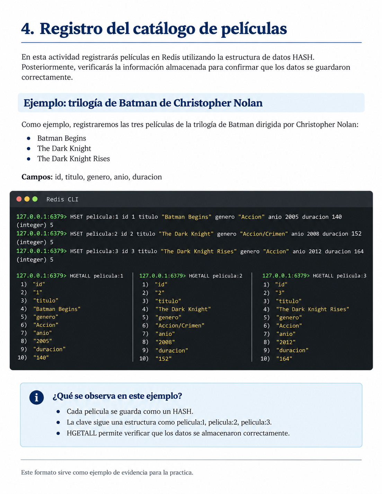

---
title: "Práctica 4. Gestión de una plataforma de streaming con Redis"
toc: true
number-sections: true
---

## Objetivo

Aplicar las principales estructuras y comandos de Redis mediante la simulación de una plataforma de streaming que administra películas, sesiones, reproducciones y preferencias de los usuarios.

## Descripción

Una plataforma de streaming necesita almacenar y consultar información relacionada con su catálogo de películas y la actividad de sus usuarios.

En esta práctica utilizarás Redis para simular algunas de estas funciones, seleccionando los comandos adecuados para cada actividad.

{#fig-streaming-redis fig-align="center" width="100%"}

## Indicaciones generales

Durante la práctica deberás elaborar un documento de Word en el que registres los resultados de cada actividad.

El documento deberá incluir una portada con tu nombre, matrícula y grupo.

Para cada actividad, incorpora los siguientes elementos:

1. **Descripción:** explica brevemente qué realizaste.
2. **Comandos utilizados:** escribe los comandos que ejecutaste en Redis.
3. **Evidencia:** inserta una captura de pantalla donde se observen los comandos y sus resultados.

Completa cada apartado conforme avances en la práctica. No es necesario tomar una captura por cada comando, siempre que las evidencias permitan verificar las operaciones solicitadas.

Al finalizar, convierte el documento de Word a PDF y entrégalo en Eminus.

## Registro del catálogo de películas

Imagina que administras una plataforma de streaming.

Registra al menos **cinco películas** utilizando la estructura `HASH`.

Cada película deberá contener los siguientes atributos:

- Identificador.
- Título.
- Género.
- Año de estreno.
- Duración en minutos.

Utiliza nombres de claves que permitan identificar fácilmente cada película.

Una vez registradas, consulta la información para comprobar que los datos se almacenaron correctamente.

### Ejemplo de cómo documentar la actividad

La siguiente imagen muestra un ejemplo del registro de las tres películas de la trilogía de Batman de Christopher Nolan.

Observa cómo se utilizan los comandos `HSET` para almacenar la información y `HGETALL` para consultar los datos de cada película.

{#fig-ejemplo-batman fig-align="center" width="100%"}

Este ejemplo sirve como referencia para elaborar tu documento. Deberás seleccionar tus propias películas y registrar sus respectivos atributos.

**Documenta esta actividad en Word** con una breve descripción, los comandos utilizados y una captura de los resultados obtenidos.

## Administración de sesiones

La plataforma necesita identificar temporalmente a los usuarios que han iniciado sesión.

Registra **tres sesiones** utilizando la estructura `STRING`.

Cada sesión deberá:

- Tener una clave que permita identificarla.
- Almacenar el identificador del usuario.
- Expirar automáticamente después de 10 minutos.

Comprueba que las sesiones se almacenaron correctamente y consulta el tiempo restante de al menos una de ellas.

**Documenta esta actividad en Word** con una breve descripción, los comandos utilizados y una captura de los resultados obtenidos.

## Función "Continuar viendo"

La plataforma debe recordar la última película que estaba reproduciendo cada usuario.

Registra la siguiente información para **tres usuarios**:

- Identificador del usuario.
- Identificador de la última película reproducida.
- Segundo exacto en el que se detuvo la reproducción.

Selecciona una estructura de Redis que permita almacenar esta información.

Posteriormente, consulta los datos registrados para comprobar que es posible recuperar la última película y el segundo en el que cada usuario detuvo su reproducción.

**Documenta esta actividad en Word** con una breve descripción, los comandos utilizados y una captura de los resultados obtenidos.

## Contador de reproducciones

La plataforma necesita conocer cuántas veces se reproduce cada película.

Implementa un contador para las **cinco películas** registradas anteriormente.

Realiza las siguientes operaciones:

1. Inicializa los contadores.
2. Simula varias reproducciones incrementando los contadores.
3. Consulta el número total de reproducciones de cada película.

**Documenta esta actividad en Word** con una breve descripción, los comandos utilizados y una captura de los resultados obtenidos.

## Películas favoritas

Cada usuario podrá guardar sus películas favoritas.

Utiliza la estructura `SET` para registrar las películas favoritas de **tres usuarios**.

Realiza las siguientes operaciones:

1. Agrega tres películas favoritas por usuario.
2. Consulta las películas favoritas registradas para cada uno.
3. Comprueba que la información se almacenó correctamente.

**Documenta esta actividad en Word** con una breve descripción, los comandos utilizados y una captura de los resultados obtenidos.

## Ranking de películas

La plataforma necesita identificar las películas con mayor número de reproducciones.

Utiliza la estructura `SORTED SET` para crear un ranking de las cinco películas registradas.

Asigna una puntuación a cada película que represente su número de reproducciones.

Consulta el ranking de mayor a menor, mostrando las películas y sus respectivas puntuaciones.

**Documenta esta actividad en Word** con una breve descripción, los comandos utilizados y una captura del ranking obtenido.

## Evidencia de entrega

Entrega un documento en PDF que contenga:

- Portada con nombre, matrícula y grupo.
- Las seis actividades desarrolladas.
- Una breve descripción de lo realizado en cada actividad.
- Los comandos utilizados.
- Capturas de pantalla de los resultados obtenidos.

**Importante:** Cada estudiante deberá crear su propio catálogo de películas y utilizar identificadores consistentes en todas las actividades.

El documento deberá elaborarse conforme se realizan los ejercicios en Redis. Al finalizar la práctica, conviértelo a PDF y súbelo a Eminus.
