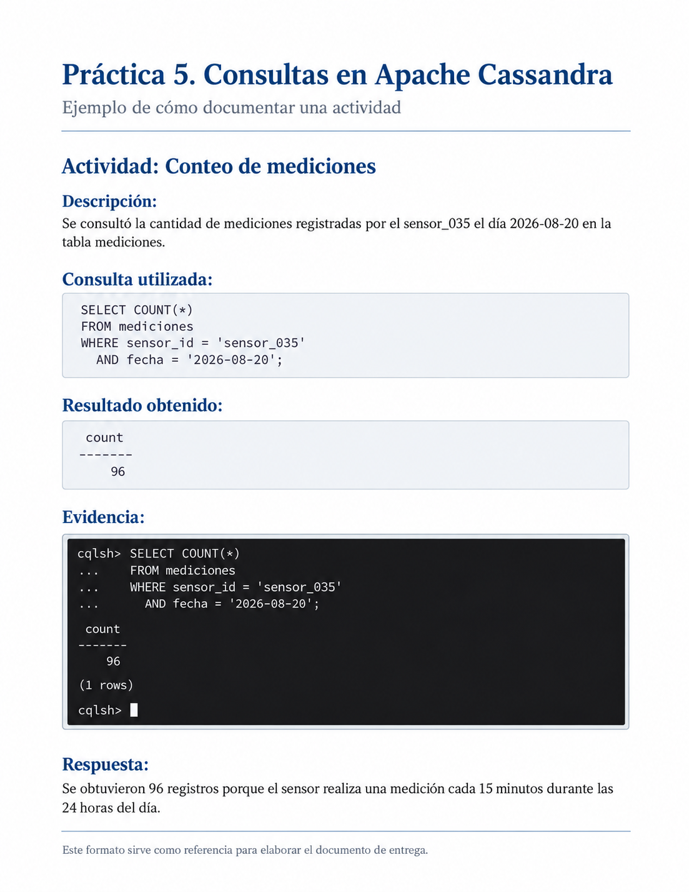

## Objetivo

Aplicar consultas en Apache Cassandra utilizando una base de datos de monitoreo ambiental con más de un millón de registros.

Durante la práctica se reforzarán los conceptos de clave de partición, columnas de agrupamiento, consultas por intervalos y diseño orientado a consultas.

## Descripción

En la práctica anterior se generó e importó una base de datos con mediciones simuladas de temperatura y humedad.

La tabla `mediciones` contiene información de:

```text
100 sensores
```

durante:

```text
127 días
```

con una medición cada:

```text
15 minutos
```

En total se almacenaron:

```text
1,219,200 registros
```

En esta práctica utilizarás esa misma información para realizar diferentes consultas en Apache Cassandra y analizar cómo influye el diseño de la tabla en la recuperación de los datos.

La estructura de la tabla es:

```sql
CREATE TABLE mediciones (
    sensor_id TEXT,
    fecha DATE,
    momento TIMESTAMP,
    temperatura DECIMAL,
    humedad DECIMAL,
    PRIMARY KEY ((sensor_id, fecha), momento)
) WITH CLUSTERING ORDER BY (momento DESC);
```

La clave de partición está formada por:

```text
(sensor_id, fecha)
```

mientras que:

```text
momento
```

organiza los registros dentro de cada partición.

## Indicaciones generales

Durante la práctica deberás elaborar un documento de Word en el que registres los resultados de cada actividad.

El documento deberá incluir una portada con tu nombre, matrícula y grupo.

Para cada actividad incorpora los siguientes elementos:

1. **Descripción:** explica brevemente qué realizaste.
2. **Consulta utilizada:** escribe la instrucción CQL que ejecutaste.
3. **Evidencia:** inserta una captura de pantalla donde se observe la consulta y el resultado obtenido.
4. **Respuesta:** contesta las preguntas planteadas en cada actividad.

Completa cada apartado conforme avances en la práctica.

No es necesario incluir nuevamente el proceso de generación ni de importación del archivo CSV.

Al finalizar, convierte el documento de Word a PDF y entrégalo en Eminus.

### Ejemplo de cómo documentar la actividad

La siguiente imagen muestra un ejemplo de cómo puedes organizar en Word los resultados obtenidos durante la práctica.

Para cada actividad incluye:

- Una breve descripción de lo realizado.
- La consulta CQL utilizada.
- El resultado obtenido.
- Una captura de pantalla como evidencia.
- Las respuestas a las preguntas correspondientes.

{#fig-ejemplo-cassandra fig-align="center" width="100%"}

Este ejemplo sirve únicamente como referencia para la presentación del documento. Los resultados pueden variar de acuerdo con las consultas realizadas y los valores almacenados en la base de datos.

**Elabora tu documento conforme avances en cada una de las actividades de la práctica.**

## Preparar Cassandra

Abre Docker Desktop y espera a que se encuentre funcionando.

Después abre PowerShell en Windows o Terminal en macOS.

Inicia el contenedor:

```bash
docker start cassandra-lab
```

Comprueba que se encuentre activo:

```bash
docker ps
```

Después entra a Cassandra:

```bash
docker exec -it cassandra-lab cqlsh
```

Selecciona el espacio de claves:

```sql
USE monitoreo_ambiental;
```

Antes de comenzar, comprueba que los datos de la práctica anterior continúan almacenados.

Ejecuta:

```sql
SELECT COUNT(*)
FROM mediciones
WHERE sensor_id = 'sensor_001'
  AND fecha = '2026-06-01';
```

El resultado esperado es:

```text
96
```

Si obtienes este resultado, puedes continuar con la práctica.

---

## Consulta de las mediciones de un sensor

Consulta todas las mediciones realizadas por:

```text
sensor_020
```

durante:

```text
15 de julio de 2026
```

La consulta deberá mostrar únicamente:

- Momento.
- Temperatura.
- Humedad.

Una vez realizada la consulta, responde:

1. ¿Cuántos registros fueron recuperados?
2. ¿Por qué Cassandra puede localizar directamente esta información?
3. ¿Qué valores forman la clave de partición utilizada?

**Documenta esta actividad en Word** con una breve descripción, la consulta utilizada, una captura del resultado y las respuestas correspondientes.

## Conteo de mediciones

Determina cuántas mediciones fueron registradas por:

```text
sensor_035
```

el día:

```text
20 de agosto de 2026
```

Utiliza una consulta que permita contar los registros almacenados en esa partición.

Una vez realizada la consulta, responde:

1. ¿Cuántos registros se obtuvieron?
2. ¿Por qué se espera encontrar 96 mediciones?
3. ¿Qué representa cada uno de esos registros?

**Documenta esta actividad en Word** con una breve descripción, la consulta utilizada, una captura del resultado y las respuestas correspondientes.

## Mediciones más recientes

Consulta las:

```text
5 mediciones más recientes
```

del:

```text
sensor_075
```

durante el:

```text
20 de septiembre de 2026
```

Muestra solamente:

- Momento.
- Temperatura.
- Humedad.

Una vez realizada la consulta, responde:

1. ¿Cuál es la primera hora mostrada?
2. ¿Por qué las mediciones aparecen de la más reciente a la más antigua?
3. ¿Qué relación tiene este resultado con:

```text
CLUSTERING ORDER BY (momento DESC)
```

?

**Documenta esta actividad en Word** con una breve descripción, la consulta utilizada, una captura del resultado y las respuestas correspondientes.

## Consulta por intervalo de tiempo

Consulta las mediciones del:

```text
sensor_010
```

correspondientes al:

```text
10 de agosto de 2026
```

entre las:

```text
08:00
```

y las:

```text
10:00
```

Muestra:

- Momento.
- Temperatura.
- Humedad.

Una vez realizada la consulta, responde:

1. ¿Cuántas mediciones fueron recuperadas?
2. ¿Por qué es posible utilizar `momento` para establecer el intervalo?
3. ¿Qué función cumple `momento` dentro de la clave primaria?

**Documenta esta actividad en Word** con una breve descripción, la consulta utilizada, una captura del resultado y las respuestas correspondientes.

## Consulta de una medición específica

Consulta la temperatura y humedad registradas por:

```text
sensor_050
```

el día:

```text
1 de septiembre de 2026
```

a las:

```text
14:30
```

Muestra únicamente:

- Momento.
- Temperatura.
- Humedad.

Una vez realizada la consulta, responde:

1. ¿Qué columnas fueron necesarias para localizar exactamente ese registro?
2. ¿Qué parte corresponde a la clave de partición?
3. ¿Qué columna permite identificar la medición dentro de la partición?

**Documenta esta actividad en Word** con una breve descripción, la consulta utilizada, una captura del resultado y las respuestas correspondientes.

## Comparación entre sensores

Consulta las primeras:

```text
10 mediciones
```

del:

```text
sensor_025
```

y del:

```text
sensor_026
```

para el día:

```text
5 de octubre de 2026
```

Realiza una consulta para cada sensor.

Después responde:

1. ¿Los registros de ambos sensores pertenecen a la misma partición?
2. ¿Por qué?
3. ¿Qué combinación de valores identifica cada partición?

**Documenta esta actividad en Word** con una breve descripción, las consultas utilizadas, una captura de los resultados y las respuestas correspondientes.

## Consulta utilizando solamente el sensor

Intenta recuperar las mediciones utilizando únicamente:

```text
sensor_id
```

Por ejemplo:

```sql
SELECT *
FROM mediciones
WHERE sensor_id = 'sensor_001';
```

Observa el mensaje generado por Cassandra.

Después responde:

1. ¿La consulta se ejecutó correctamente?
2. ¿Por qué no es suficiente utilizar solamente `sensor_id`?
3. ¿Qué otro campo forma parte de la clave de partición?

**Documenta esta actividad en Word** con una breve descripción, la consulta utilizada, una captura del mensaje obtenido y las respuestas correspondientes.

## Consulta por temperatura

Supongamos que necesitamos conocer todas las mediciones cuya temperatura sea superior a:

```text
30 °C
```

Intenta ejecutar:

```sql
SELECT *
FROM mediciones
WHERE temperatura > 30;
```

Observa el resultado o mensaje generado por Cassandra.

Después responde:

1. ¿La consulta se ejecutó?
2. ¿`temperatura` forma parte de la clave de partición?
3. ¿`temperatura` es una columna de agrupamiento?
4. ¿Por qué Cassandra no puede localizar directamente esos registros?

**Documenta esta actividad en Word** con una breve descripción, la consulta utilizada, una captura del resultado y las respuestas correspondientes.

## Uso de `ALLOW FILTERING`

Ahora ejecuta:

```sql
SELECT *
FROM mediciones
WHERE temperatura > 30
ALLOW FILTERING;
```

Observa el resultado.

Después responde:

1. ¿Qué diferencia existe con la consulta anterior?
2. ¿Qué permite hacer `ALLOW FILTERING`?
3. ¿Consideras adecuado utilizar este tipo de consulta constantemente sobre más de un millón de registros?
4. Explica brevemente por qué.

::: {.callout-warning}
`ALLOW FILTERING` permite ejecutar determinadas consultas que no corresponden directamente con el diseño de la tabla.

Sin embargo, no significa que la consulta sea eficiente.
:::

**Documenta esta actividad en Word** con una breve descripción, la consulta utilizada, una captura del resultado y las respuestas correspondientes.

## Diseño orientado a consultas

Imagina que una aplicación necesita responder frecuentemente la siguiente pregunta:

> ¿Qué sensores registraron temperaturas superiores a 30 °C en una fecha determinada?

La tabla actual fue diseñada principalmente para responder consultas como:

> ¿Qué mediciones realizó un sensor durante un día?

Responde:

1. ¿La tabla `mediciones` está diseñada adecuadamente para buscar directamente todas las temperaturas superiores a 30 °C?
2. ¿Sería recomendable utilizar `ALLOW FILTERING` cada vez que se necesite esta información?
3. ¿Qué alternativa propondrías?
4. ¿Por qué en Cassandra es importante conocer primero las consultas que realizará una aplicación?

**Documenta esta actividad en Word** con tus respuestas.

## Reflexión final

Para finalizar, responde con tus propias palabras:

1. ¿Cuál es la clave de partición de la tabla `mediciones`?
2. ¿Qué función cumple la columna `momento`?
3. ¿Por qué una consulta utilizando `sensor_id` y `fecha` es eficiente?
4. ¿Por qué una consulta utilizando solamente `temperatura` no corresponde con el diseño actual?
5. Explica la siguiente idea:

```text
En Cassandra primero pensamos en las consultas
y después diseñamos las tablas.
```

## Evidencia de entrega

Entrega un documento en PDF que contenga:

- Portada con nombre, matrícula y grupo.
- Las actividades desarrolladas.
- Una breve descripción de lo realizado en cada actividad.
- Las consultas utilizadas.
- Capturas de pantalla de los resultados obtenidos.
- Las respuestas a las preguntas planteadas.
- La reflexión final.

**Importante:** utiliza la base de datos de monitoreo ambiental creada en la práctica anterior. No es necesario volver a generar ni importar los 1,219,200 registros.

El documento deberá elaborarse conforme se realizan los ejercicios en Cassandra. Al finalizar la práctica, conviértelo a PDF y súbelo a Eminus.